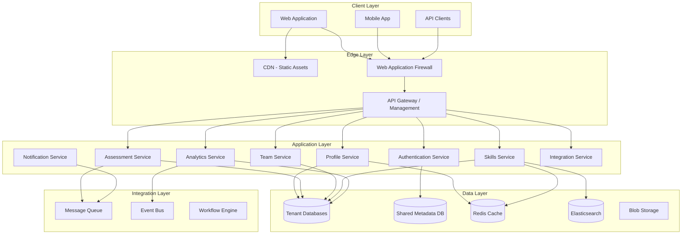
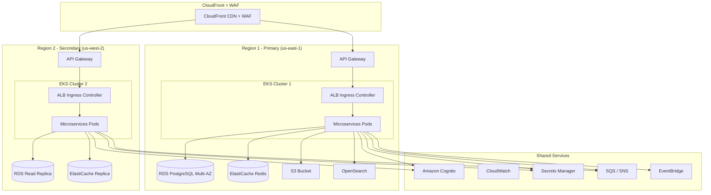
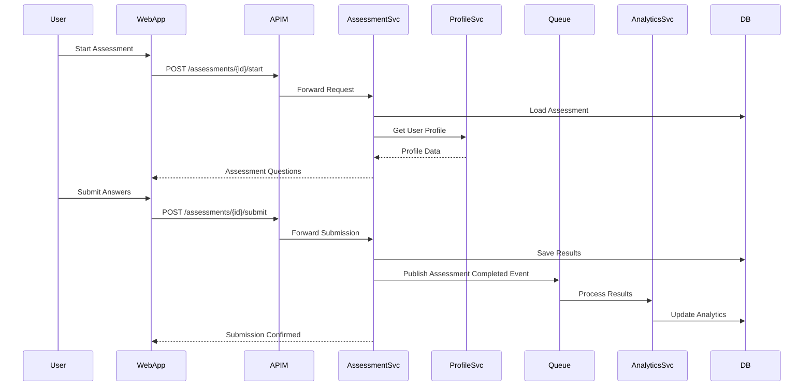
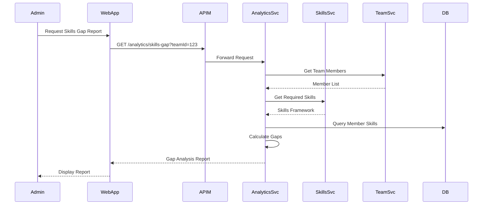
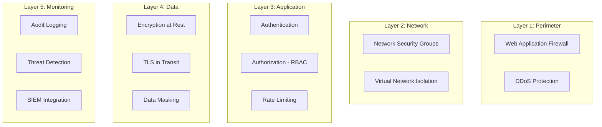
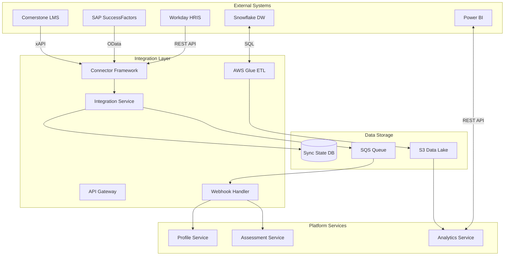

# System Architecture Overview

## Executive Summary

This document outlines the architecture for a multi-tenant SaaS platform designed for skills assessment and competency framework management. The platform supports organizational skills tracking, employee assessments, and workforce development with complete tenant isolation and enterprise-grade security.

## Platform Modules

### Core Functional Modules

1. **Profile Management** - Employee profiles with skills, certifications, and career history
2. **Assessments** - Create, manage, and execute skill assessments
3. **Employees** - Workforce directory and employee management
4. **Teams** - Team structures, hierarchies, and collaboration
5. **Roles** - Role definitions with required competencies
6. **Skills Frameworks** - Industry-standard competency frameworks (e.g., SFIA, O*NET)
7. **Skill Assessments** - Assessment execution and results tracking
8. **Skills Directory** - Comprehensive catalog of skills and competencies
9. **Admin Dashboard** - Organization-level administration and analytics
10. **Integrations Hub** - Enterprise integrations with HR, talent, and data platforms

## High-Level Architecture

## Architecture Principles

### 1. Multi-Tenancy First
- **Complete data isolation** between organizations
- **Tenant-aware** services and middleware
- **Configurable** tenant-specific features and branding
- **Scalable** to support thousands of tenants

### 2. API-First Design
- **RESTful APIs** for standard CRUD operations
- **GraphQL** for flexible data querying
- **Webhook support** for event-driven integrations
- **Comprehensive API documentation** with OpenAPI/Swagger

### 3. Microservices Architecture
- **Loosely coupled** services with clear boundaries
- **Independent deployment** and scaling
- **Technology diversity** where appropriate
- **Resilient** with circuit breakers and retry logic

### 4. Cloud-Native
- **Containerized** workloads (Docker/Kubernetes)
- **Auto-scaling** based on demand
- **Managed services** for databases, caching, messaging
- **Multi-region** deployment capability

### 5. Security by Design
- **Zero-trust** security model
- **Encryption** at rest and in transit
- **RBAC** and fine-grained permissions
- **Audit logging** for compliance
- **SSO/SAML** integration

## Deployment Architecture

### Recommended Cloud Platform: AWS

### Infrastructure Components

| Component | Technology Options | Recommended |
|-----------|-------------------|-------------|
| **Container Orchestration** | EKS, AKS, GKE, Self-managed K8s | Amazon EKS |
| **API Gateway** | AWS API Gateway, Kong, Apigee | AWS API Gateway |
| **Load Balancer** | CloudFront, ALB, Cloudflare | CloudFront + ALB |
| **Primary Database** | RDS PostgreSQL, Aurora PostgreSQL, MySQL | RDS PostgreSQL Multi-AZ |
| **Cache** | ElastiCache Redis, Memcached | ElastiCache for Redis |
| **Search** | OpenSearch, Elasticsearch, Algolia | Amazon OpenSearch Service |
| **Object Storage** | S3, Azure Blob, GCS | Amazon S3 |
| **Message Queue** | SQS/SNS, EventBridge, Kafka | SQS + SNS + EventBridge |
| **Identity** | Cognito, Auth0, Okta | Amazon Cognito |
| **Monitoring** | CloudWatch, Datadog, New Relic | CloudWatch + X-Ray |

## Service Architecture

### Core Services

#### 1. Authentication & Authorization Service
**Responsibilities:**
- User authentication (SSO, SAML, OAuth2)
- Token management (JWT)
- Multi-factor authentication
- Session management
- Tenant identification

**Technology Stack:**
- Identity Provider: Amazon Cognito
- Token Service: Custom Node.js / .NET Core
- Session Store: ElastiCache Redis

#### 2. Profile Service
**Responsibilities:**
- Employee profile management
- Skills inventory
- Certifications and credentials
- Career history
- Personal development plans

**API Endpoints:**
- `GET /api/v1/profiles/{userId}`
- `PUT /api/v1/profiles/{userId}`
- `GET /api/v1/profiles/{userId}/skills`
- `POST /api/v1/profiles/{userId}/certifications`

#### 3. Assessment Service
**Responsibilities:**
- Assessment creation and templates
- Question banks
- Assessment scheduling
- Results processing
- Scoring algorithms

**API Endpoints:**
- `POST /api/v1/assessments`
- `GET /api/v1/assessments/{assessmentId}`
- `POST /api/v1/assessments/{assessmentId}/submit`
- `GET /api/v1/assessments/{assessmentId}/results`

#### 4. Skills Service
**Responsibilities:**
- Skills catalog management
- Framework management (SFIA, O*NET, custom)
- Skills taxonomy
- Skills search and discovery
- Skills gap analysis

**API Endpoints:**
- `GET /api/v1/skills`
- `GET /api/v1/skills/{skillId}`
- `GET /api/v1/frameworks`
- `POST /api/v1/frameworks/{frameworkId}/skills`

#### 5. Team Service
**Responsibilities:**
- Team structure management
- Team member assignments
- Team skills aggregation
- Organizational hierarchy

**API Endpoints:**
- `GET /api/v1/teams`
- `POST /api/v1/teams`
- `GET /api/v1/teams/{teamId}/members`
- `POST /api/v1/teams/{teamId}/members`

#### 6. Analytics Service
**Responsibilities:**
- Skills gap analysis
- Competency reporting
- Trend analysis
- Dashboard metrics
- Data export

**API Endpoints:**
- `GET /api/v1/analytics/skills-gap`
- `GET /api/v1/analytics/team/{teamId}/competency`
- `GET /api/v1/analytics/trends`

#### 7. Integration Service
**Responsibilities:**
- Enterprise system integrations (HR, talent, data platforms)
- Data synchronization and ETL
- Webhook management
- API connector framework
- Integration marketplace

**Supported Integration Categories:**

**HR Information Systems (HRIS):**
- Workday - Employee data sync, org structure
- SAP SuccessFactors - Performance data, learning records
- Oracle HCM - Compensation, succession planning
- ADP Workforce Now - Payroll, time tracking
- BambooHR - Employee profiles, onboarding

**Talent Management Platforms:**
- Cornerstone OnDemand - Learning & development
- Degreed - Skills tracking, learning pathways
- LinkedIn Learning - Course completions, skills
- Udemy Business - Training records
- Pluralsight - Technical skills assessments

**Data & Analytics Platforms:**
- Snowflake - Data warehouse integration
- Databricks - Advanced analytics, ML models
- Tableau - Visualization and reporting
- Power BI - Dashboard integration
- Looker - Embedded analytics

**Collaboration & Productivity:**
- Microsoft Teams - Notifications, bot integration
- Slack - Alerts, workflow automation
- Google Workspace - Calendar, Drive integration
- Zoom - Virtual assessment proctoring

**API Endpoints:**
- `GET /api/v1/integrations`
- `POST /api/v1/integrations/{platform}/connect`
- `GET /api/v1/integrations/{integrationId}/sync-status`
- `POST /api/v1/integrations/{integrationId}/sync`
- `GET /api/v1/integrations/webhooks`
- `POST /api/v1/integrations/webhooks`

**Technology Stack:**
- Integration Framework: Apache Camel / Mulesoft
- ETL: AWS Glue / Step Functions
- API Connectors: Custom Node.js services
- Webhook Queue: SQS + Lambda
- Sync State: DynamoDB

## Data Flow Patterns

### 1. Assessment Execution Flow

### 2. Skills Gap Analysis Flow

## Scalability Considerations

### Horizontal Scaling
- **Stateless services** enable unlimited horizontal scaling
- **Auto-scaling** based on CPU, memory, and custom metrics
- **Load balancing** across service instances
- **Database read replicas** for read-heavy workloads

### Vertical Scaling
- **Database tier upgrades** for increased capacity
- **Cache size increases** for better performance
- **Compute tier adjustments** for resource-intensive operations

### Performance Optimization
- **Caching strategy** at multiple layers (CDN, application, database)
- **Database indexing** on frequently queried fields
- **Query optimization** and materialized views
- **Asynchronous processing** for long-running operations
- **CDN** for static assets and media

## High Availability & Disaster Recovery

### Availability Targets
- **SLA:** 99.9% uptime (43.8 minutes downtime/month)
- **RTO (Recovery Time Objective):** < 1 hour
- **RPO (Recovery Point Objective):** < 5 minutes

### HA Strategies
- **Multi-region deployment** with active-passive or active-active
- **Database replication** with automatic failover
- **Geo-redundant storage** for backups
- **Health checks** and automatic pod restarts
- **Circuit breakers** to prevent cascade failures

### Backup Strategy
- **Automated daily backups** with 30-day retention
- **Point-in-time recovery** for databases
- **Geo-redundant backup storage**
- **Regular restore testing** (quarterly)

## Security Architecture

### Defense in Depth

### Security Controls
- **Authentication:** Amazon Cognito with MFA
- **Authorization:** Role-Based Access Control (RBAC)
- **Encryption:** TLS 1.3 in transit, AES-256 at rest
- **Secrets Management:** AWS Secrets Manager
- **Network Security:** VPC, Security Groups, NACLs, PrivateLink
- **Compliance:** SOC 2, ISO 27001, GDPR ready, HIPAA eligible

## Integration Patterns

### Inbound Integrations
- **REST APIs** for standard integrations
- **GraphQL** for flexible data queries
- **Webhooks** for event notifications
- **SAML/SSO** for identity federation
- **SCIM** for user provisioning

### Outbound Integrations

**HR Information Systems:**
- **Workday** - Employee sync via REST API
- **SAP SuccessFactors** - OData API integration
- **Oracle HCM** - SOAP/REST web services
- **ADP** - Marketplace API integration

**Learning Management Systems:**
- **Cornerstone OnDemand** - xAPI/SCORM integration
- **Degreed** - Skills API, learning records
- **LinkedIn Learning** - OAuth2 + REST API

**Data Platforms:**
- **Snowflake** - Direct SQL connector, data sharing
- **Databricks** - Delta Lake integration
- **AWS S3** - Bulk data export/import

**Communication:**
- **Email/Notifications** - Amazon SES, SendGrid
- **SMS** - Twilio, AWS SNS
- **Slack/Teams** - Bot framework, webhooks

**Analytics & BI:**
- **Power BI** - Embedded reports, REST API
- **Tableau** - Hyper API, web data connector
- **Looker** - Embedded dashboards

### Integration Architecture

## Technology Stack Summary

| Layer | Technology | Justification |
|-------|-----------|---------------|
| **Frontend** | React + TypeScript | Modern, flexible, large ecosystem |
| **Backend** | Node.js / .NET Core | Enterprise-grade, high performance |
| **API Gateway** | AWS API Gateway | Serverless, scalable, pay-per-use |
| **Container Platform** | Amazon EKS | Managed Kubernetes, AWS integration |
| **Primary Database** | RDS PostgreSQL | ACID compliance, multi-tenancy support |
| **Cache** | ElastiCache Redis | High performance, pub/sub support |
| **Search** | Amazon OpenSearch | Managed, scalable search and analytics |
| **Message Queue** | SQS + SNS | Reliable messaging, dead-letter queues |
| **Identity** | Amazon Cognito | User pools, federated identity, MFA |
| **Monitoring** | CloudWatch + X-Ray | Integrated monitoring and tracing |

## Next Steps

1. Review [TECHNICAL_DESIGN.md](file:///Users/rekhasunil/Documents/Sunil/poc-antigravity/saas_platform/docs/TECHNICAL_DESIGN.md) for detailed implementation guidance
2. Understand multi-tenancy in [DATA_SEGMENTATION.md](file:///Users/rekhasunil/Documents/Sunil/poc-antigravity/saas_platform/docs/DATA_SEGMENTATION.md)
3. Analyze pricing model in [COST_MODEL.md](file:///Users/rekhasunil/Documents/Sunil/poc-antigravity/saas_platform/docs/COST_MODEL.md)
4. Explore frontend options in [FRONTEND_OPTIONS.md](file:///Users/rekhasunil/Documents/Sunil/poc-antigravity/saas_platform/docs/FRONTEND_OPTIONS.md)
5. Review backend choices in [BACKEND_OPTIONS.md](file:///Users/rekhasunil/Documents/Sunil/poc-antigravity/saas_platform/docs/BACKEND_OPTIONS.md)
