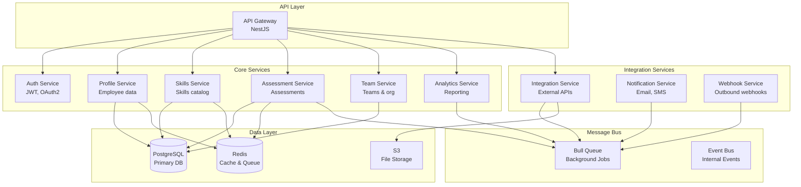

# Backend Architecture Options

## Overview

This document analyzes backend technology options for the SaaS platform, comparing frameworks, architectures, and implementation approaches. The goal is to build **scalable business logic** that supports multi-tenancy, integrations, and high performance.

## Key Requirements

### Functional Requirements
- ✅ **Multi-tenant data isolation** - Secure tenant separation
- ✅ **RESTful & GraphQL APIs** - Flexible API options
- ✅ **Real-time capabilities** - WebSocket support
- ✅ **Background jobs** - Async processing (assessments, reports)
- ✅ **Integrations** - HR, talent, data platform connectors
- ✅ **Event-driven** - Pub/sub for scalability

### Non-Functional Requirements
- ⚡ **Performance** - < 100ms API response time (p95)
- 📈 **Scalability** - Handle 10,000+ concurrent users
- 🔒 **Security** - JWT auth, RBAC, audit logging
- 🛡️ **Reliability** - 99.9% uptime, circuit breakers
- 📊 **Observability** - Logging, metrics, tracing

---

## Framework Comparison

### Option 1: Node.js with NestJS (Recommended)

**Architecture:** Microservices with TypeScript

```
saas-platform-backend/
├── apps/
│   ├── api-gateway/          # API Gateway service
│   ├── auth-service/          # Authentication service
│   ├── profile-service/       # Profile management
│   ├── skills-service/        # Skills & frameworks
│   ├── assessment-service/    # Assessments
│   ├── integration-service/   # External integrations
│   └── analytics-service/     # Analytics & reporting
├── libs/
│   ├── common/                # Shared utilities
│   ├── database/              # Database modules
│   ├── auth/                  # Auth guards & decorators
│   └── tenant/                # Multi-tenancy utilities
├── docker-compose.yml
└── package.json
```

**Tech Stack:**
- **Framework:** NestJS 10+
- **Language:** TypeScript 5+
- **Database ORM:** Prisma or TypeORM
- **Validation:** class-validator + class-transformer
- **API Docs:** Swagger/OpenAPI
- **Testing:** Jest + Supertest
- **Message Queue:** Bull (Redis-based)
- **Caching:** Redis
- **Logging:** Winston + Morgan

**Pros:**
- ✅ **TypeScript native** - End-to-end type safety
- ✅ **Modular architecture** - Dependency injection, decorators
- ✅ **Microservices ready** - Built-in support
- ✅ **GraphQL support** - Code-first approach
- ✅ **Large ecosystem** - npm packages
- ✅ **Developer experience** - CLI, hot reload
- ✅ **Testing** - Excellent testing utilities

**Cons:**
- ❌ **Performance** - Slower than Go/Rust
- ❌ **Memory usage** - Higher than compiled languages
- ❌ **Learning curve** - Decorators, DI concepts

**Code Example:**
```typescript
// apps/skills-service/src/skills/skills.controller.ts
import { Controller, Get, Post, Body, Param, UseGuards } from '@nestjs/common';
import { ApiTags, ApiBearerAuth, ApiOperation } from '@nestjs/swagger';
import { SkillsService } from './skills.service';
import { CreateSkillDto } from './dto/create-skill.dto';
import { JwtAuthGuard } from '@app/auth/guards/jwt-auth.guard';
import { TenantId } from '@app/tenant/decorators/tenant-id.decorator';

@ApiTags('skills')
@ApiBearerAuth()
@Controller('skills')
@UseGuards(JwtAuthGuard)
export class SkillsController {
  constructor(private readonly skillsService: SkillsService) {}

  @Get()
  @ApiOperation({ summary: 'Get all skills for tenant' })
  async findAll(@TenantId() tenantId: string) {
    return this.skillsService.findAll(tenantId);
  }

  @Post()
  @ApiOperation({ summary: 'Create a new skill' })
  async create(
    @TenantId() tenantId: string,
    @Body() createSkillDto: CreateSkillDto,
  ) {
    return this.skillsService.create(tenantId, createSkillDto);
  }

  @Get(':id')
  @ApiOperation({ summary: 'Get skill by ID' })
  async findOne(
    @TenantId() tenantId: string,
    @Param('id') id: string,
  ) {
    return this.skillsService.findOne(tenantId, id);
  }
}

// apps/skills-service/src/skills/skills.service.ts
import { Injectable, NotFoundException } from '@nestjs/common';
import { PrismaService } from '@app/database/prisma.service';
import { CreateSkillDto } from './dto/create-skill.dto';
import { CacheService } from '@app/common/cache.service';

@Injectable()
export class SkillsService {
  constructor(
    private prisma: PrismaService,
    private cache: CacheService,
  ) {}

  async findAll(tenantId: string) {
    const cacheKey = `skills:${tenantId}`;
    
    // Check cache first
    const cached = await this.cache.get(cacheKey);
    if (cached) return cached;
    
    // Query database
    const skills = await this.prisma.skill.findMany({
      where: { tenantId },
      include: { framework: true },
    });
    
    // Cache for 5 minutes
    await this.cache.set(cacheKey, skills, 300);
    
    return skills;
  }

  async create(tenantId: string, createSkillDto: CreateSkillDto) {
    const skill = await this.prisma.skill.create({
      data: {
        ...createSkillDto,
        tenantId,
      },
    });
    
    // Invalidate cache
    await this.cache.del(`skills:${tenantId}`);
    
    return skill;
  }

  async findOne(tenantId: string, id: string) {
    const skill = await this.prisma.skill.findFirst({
      where: { id, tenantId },
    });
    
    if (!skill) {
      throw new NotFoundException(`Skill with ID ${id} not found`);
    }
    
    return skill;
  }
}

// libs/tenant/src/decorators/tenant-id.decorator.ts
import { createParamDecorator, ExecutionContext } from '@nestjs/common';

export const TenantId = createParamDecorator(
  (data: unknown, ctx: ExecutionContext) => {
    const request = ctx.switchToHttp().getRequest();
    return request.user?.tenantId || request.headers['x-tenant-id'];
  },
);
```

**Recommended For:** ✅ **Best overall choice** - TypeScript ecosystem, modern patterns

---

### Option 2: .NET Core / ASP.NET Core

**Architecture:** Microservices with C#

```
SaasPlatform.Backend/
├── src/
│   ├── ApiGateway/
│   ├── Services/
│   │   ├── AuthService/
│   │   ├── ProfileService/
│   │   ├── SkillsService/
│   │   ├── AssessmentService/
│   │   └── IntegrationService/
│   ├── Common/
│   │   ├── SaasPlatform.Common/
│   │   ├── SaasPlatform.Data/
│   │   └── SaasPlatform.Auth/
│   └── Contracts/
├── tests/
└── SaasPlatform.sln
```

**Tech Stack:**
- **Framework:** ASP.NET Core 8+
- **Language:** C# 12
- **ORM:** Entity Framework Core
- **API:** Minimal APIs or Controllers
- **Validation:** FluentValidation
- **Messaging:** MassTransit + RabbitMQ
- **Caching:** StackExchange.Redis
- **Logging:** Serilog

**Pros:**
- ✅ **Performance** - Excellent performance (faster than Node.js)
- ✅ **Type safety** - Strong typing with C#
- ✅ **Enterprise-ready** - Microsoft ecosystem
- ✅ **Tooling** - Visual Studio, Rider
- ✅ **Azure integration** - First-class Azure support
- ✅ **Async/await** - Built-in async patterns

**Cons:**
- ❌ **Verbosity** - More boilerplate than Node.js
- ❌ **Ecosystem** - Smaller than npm
- ❌ **Learning curve** - C# concepts

**Code Example:**
```csharp
// Services/SkillsService/Controllers/SkillsController.cs
using Microsoft.AspNetCore.Mvc;
using Microsoft.AspNetCore.Authorization;
using SaasPlatform.SkillsService.Services;
using SaasPlatform.SkillsService.Models;
using SaasPlatform.Common.Attributes;

namespace SaasPlatform.SkillsService.Controllers;

[ApiController]
[Route("api/v1/[controller]")]
[Authorize]
public class SkillsController : ControllerBase
{
    private readonly ISkillsService _skillsService;
    private readonly ILogger<SkillsController> _logger;

    public SkillsController(
        ISkillsService skillsService,
        ILogger<SkillsController> logger)
    {
        _skillsService = skillsService;
        _logger = logger;
    }

    [HttpGet]
    [ProducesResponseType(typeof(IEnumerable<Skill>), StatusCodes.Status200OK)]
    public async Task<IActionResult> GetSkills([FromTenant] string tenantId)
    {
        var skills = await _skillsService.GetSkillsAsync(tenantId);
        return Ok(skills);
    }

    [HttpPost]
    [ProducesResponseType(typeof(Skill), StatusCodes.Status201Created)]
    public async Task<IActionResult> CreateSkill(
        [FromTenant] string tenantId,
        [FromBody] CreateSkillRequest request)
    {
        var skill = await _skillsService.CreateSkillAsync(tenantId, request);
        return CreatedAtAction(nameof(GetSkill), new { id = skill.Id }, skill);
    }

    [HttpGet("{id}")]
    [ProducesResponseType(typeof(Skill), StatusCodes.Status200OK)]
    [ProducesResponseType(StatusCodes.Status404NotFound)]
    public async Task<IActionResult> GetSkill(
        [FromTenant] string tenantId,
        Guid id)
    {
        var skill = await _skillsService.GetSkillAsync(tenantId, id);
        
        if (skill == null)
            return NotFound();
        
        return Ok(skill);
    }
}

// Services/SkillsService/Services/SkillsService.cs
using Microsoft.EntityFrameworkCore;
using Microsoft.Extensions.Caching.Distributed;
using SaasPlatform.Data;
using SaasPlatform.SkillsService.Models;
using System.Text.Json;

namespace SaasPlatform.SkillsService.Services;

public class SkillsService : ISkillsService
{
    private readonly ApplicationDbContext _context;
    private readonly IDistributedCache _cache;
    private readonly ILogger<SkillsService> _logger;

    public SkillsService(
        ApplicationDbContext context,
        IDistributedCache cache,
        ILogger<SkillsService> logger)
    {
        _context = context;
        _cache = cache;
        _logger = logger;
    }

    public async Task<IEnumerable<Skill>> GetSkillsAsync(string tenantId)
    {
        var cacheKey = $"skills:{tenantId}";
        
        // Try cache first
        var cachedData = await _cache.GetStringAsync(cacheKey);
        if (cachedData != null)
        {
            return JsonSerializer.Deserialize<IEnumerable<Skill>>(cachedData);
        }
        
        // Query database
        var skills = await _context.Skills
            .Where(s => s.TenantId == tenantId)
            .Include(s => s.Framework)
            .ToListAsync();
        
        // Cache for 5 minutes
        var options = new DistributedCacheEntryOptions
        {
            AbsoluteExpirationRelativeToNow = TimeSpan.FromMinutes(5)
        };
        
        await _cache.SetStringAsync(
            cacheKey,
            JsonSerializer.Serialize(skills),
            options);
        
        return skills;
    }

    public async Task<Skill> CreateSkillAsync(
        string tenantId,
        CreateSkillRequest request)
    {
        var skill = new Skill
        {
            Id = Guid.NewGuid(),
            TenantId = tenantId,
            Name = request.Name,
            Description = request.Description,
            Category = request.Category,
            CreatedAt = DateTime.UtcNow
        };
        
        _context.Skills.Add(skill);
        await _context.SaveChangesAsync();
        
        // Invalidate cache
        await _cache.RemoveAsync($"skills:{tenantId}");
        
        _logger.LogInformation(
            "Created skill {SkillId} for tenant {TenantId}",
            skill.Id,
            tenantId);
        
        return skill;
    }
}
```

**Recommended For:** ✅ **Enterprise customers** or **Microsoft-heavy** environments

---

### Option 3: Python with FastAPI

**Architecture:** Microservices with Python

**Tech Stack:**
- **Framework:** FastAPI
- **Language:** Python 3.11+
- **ORM:** SQLAlchemy 2.0
- **Validation:** Pydantic V2
- **Async:** asyncio + uvloop
- **Messaging:** Celery + Redis
- **Caching:** Redis
- **Testing:** pytest

**Pros:**
- ✅ **Fast development** - Concise syntax
- ✅ **Type hints** - Python type annotations
- ✅ **Auto docs** - Swagger/ReDoc generation
- ✅ **ML/AI ready** - Great for data science
- ✅ **Async support** - Native async/await

**Cons:**
- ❌ **Performance** - Slower than Node.js/.NET
- ❌ **Type safety** - Weaker than TypeScript/C#
- ❌ **Deployment** - More complex than Node.js

**Code Example:**
```python
# apps/skills_service/main.py
from fastapi import FastAPI, Depends, HTTPException
from sqlalchemy.ext.asyncio import AsyncSession
from typing import List
import redis.asyncio as redis

from .database import get_db
from .models import Skill
from .schemas import SkillCreate, SkillResponse
from .dependencies import get_current_tenant

app = FastAPI(title="Skills Service")

# Redis cache
cache = redis.from_url("redis://localhost")

@app.get("/skills", response_model=List[SkillResponse])
async def get_skills(
    tenant_id: str = Depends(get_current_tenant),
    db: AsyncSession = Depends(get_db)
):
    cache_key = f"skills:{tenant_id}"
    
    # Check cache
    cached = await cache.get(cache_key)
    if cached:
        return json.loads(cached)
    
    # Query database
    result = await db.execute(
        select(Skill).where(Skill.tenant_id == tenant_id)
    )
    skills = result.scalars().all()
    
    # Cache for 5 minutes
    await cache.setex(cache_key, 300, json.dumps([s.dict() for s in skills]))
    
    return skills

@app.post("/skills", response_model=SkillResponse, status_code=201)
async def create_skill(
    skill: SkillCreate,
    tenant_id: str = Depends(get_current_tenant),
    db: AsyncSession = Depends(get_db)
):
    db_skill = Skill(**skill.dict(), tenant_id=tenant_id)
    db.add(db_skill)
    await db.commit()
    await db.refresh(db_skill)
    
    # Invalidate cache
    await cache.delete(f"skills:{tenant_id}")
    
    return db_skill
```

**Recommended For:** ⚠️ **ML/AI features** or **Python-heavy** teams

---

### Option 4: Go (Golang)

**Architecture:** Microservices with Go

**Tech Stack:**
- **Framework:** Gin or Echo
- **Language:** Go 1.21+
- **ORM:** GORM or sqlx
- **Validation:** go-playground/validator
- **Messaging:** NATS or Kafka
- **Testing:** testify

**Pros:**
- ✅ **Performance** - Excellent performance
- ✅ **Concurrency** - Goroutines, channels
- ✅ **Deployment** - Single binary
- ✅ **Memory efficient** - Low memory footprint

**Cons:**
- ❌ **Verbosity** - More code than Node.js/Python
- ❌ **Ecosystem** - Smaller than npm/PyPI
- ❌ **Learning curve** - Different paradigms
- ❌ **Generics** - Recently added, less mature

**Recommended For:** ⚠️ **High-performance** requirements or **Go expertise**

---

## Recommended Architecture: Node.js with NestJS

### Technology Stack

| Layer | Technology | Justification |
|-------|-----------|---------------|
| **Framework** | NestJS 10+ | TypeScript-first, modular, DI |
| **Language** | TypeScript 5+ | Type safety, modern features |
| **Runtime** | Node.js 20 LTS | Stable, long-term support |
| **Database ORM** | Prisma | Type-safe, migrations, great DX |
| **Validation** | class-validator | Decorator-based, integrates with NestJS |
| **API Documentation** | Swagger/OpenAPI | Auto-generated from decorators |
| **Authentication** | Passport.js + JWT | Standard, flexible strategies |
| **Authorization** | CASL | Attribute-based access control |
| **Caching** | ioredis | Redis client, cluster support |
| **Message Queue** | Bull | Redis-based, job scheduling |
| **Event Bus** | EventEmitter2 | Internal events |
| **WebSocket** | Socket.io | Real-time bidirectional |
| **File Upload** | Multer | Multipart form data |
| **Logging** | Winston | Structured logging |
| **Monitoring** | Prometheus + Grafana | Metrics and dashboards |
| **Tracing** | OpenTelemetry | Distributed tracing |
| **Testing** | Jest + Supertest | Unit and integration tests |

### Microservices Architecture



### Project Structure (Monorepo)

```
saas-platform-backend/
├── apps/
│   ├── api-gateway/
│   │   ├── src/
│   │   │   ├── main.ts
│   │   │   ├── app.module.ts
│   │   │   ├── gateway.controller.ts
│   │   │   └── filters/
│   │   ├── test/
│   │   └── tsconfig.json
│   ├── auth-service/
│   │   ├── src/
│   │   │   ├── main.ts
│   │   │   ├── auth.module.ts
│   │   │   ├── auth.controller.ts
│   │   │   ├── auth.service.ts
│   │   │   ├── strategies/
│   │   │   │   ├── jwt.strategy.ts
│   │   │   │   └── cognito.strategy.ts
│   │   │   └── guards/
│   │   └── test/
│   ├── profile-service/
│   ├── skills-service/
│   ├── assessment-service/
│   ├── integration-service/
│   └── analytics-service/
├── libs/
│   ├── common/
│   │   ├── src/
│   │   │   ├── decorators/
│   │   │   ├── filters/
│   │   │   ├── interceptors/
│   │   │   ├── pipes/
│   │   │   └── utils/
│   │   └── tsconfig.lib.json
│   ├── database/
│   │   ├── src/
│   │   │   ├── prisma/
│   │   │   │   ├── schema.prisma
│   │   │   │   └── migrations/
│   │   │   ├── prisma.service.ts
│   │   │   └── database.module.ts
│   │   └── tsconfig.lib.json
│   ├── auth/
│   │   ├── src/
│   │   │   ├── guards/
│   │   │   ├── decorators/
│   │   │   └── auth.module.ts
│   │   └── tsconfig.lib.json
│   ├── tenant/
│   │   ├── src/
│   │   │   ├── tenant.service.ts
│   │   │   ├── tenant.middleware.ts
│   │   │   ├── decorators/
│   │   │   └── tenant.module.ts
│   │   └── tsconfig.lib.json
│   └── cache/
│       ├── src/
│       │   ├── cache.service.ts
│       │   └── cache.module.ts
│       └── tsconfig.lib.json
├── docker/
│   ├── Dockerfile.api-gateway
│   ├── Dockerfile.auth-service
│   └── ...
├── k8s/
│   ├── api-gateway/
│   ├── auth-service/
│   └── ...
├── scripts/
├── docker-compose.yml
├── nest-cli.json
├── package.json
├── tsconfig.json
└── README.md
```

---

## Key Implementation Patterns

### 1. Multi-Tenancy Middleware

```typescript
// libs/tenant/src/tenant.middleware.ts
import { Injectable, NestMiddleware } from '@nestjs/common';
import { Request, Response, NextFunction } from 'express';
import { TenantService } from './tenant.service';

@Injectable()
export class TenantMiddleware implements NestMiddleware {
  constructor(private tenantService: TenantService) {}

  async use(req: Request, res: Response, next: NextFunction) {
    // Extract tenant from subdomain or header
    const subdomain = req.hostname.split('.')[0];
    const tenantIdHeader = req.headers['x-tenant-id'] as string;
    
    // Get tenant from JWT if authenticated
    const jwtTenantId = req.user?.tenantId;
    
    const tenantId = jwtTenantId || tenantIdHeader || subdomain;
    
    // Validate tenant exists
    const tenant = await this.tenantService.getTenant(tenantId);
    
    if (!tenant) {
      return res.status(404).json({ error: 'Tenant not found' });
    }
    
    // Attach tenant to request
    req.tenant = tenant;
    
    next();
  }
}
```

### 2. Database Connection per Tenant

```typescript
// libs/database/src/tenant-database.service.ts
import { Injectable } from '@nestjs/common';
import { PrismaClient } from '@prisma/client';

@Injectable()
export class TenantDatabaseService {
  private connections = new Map<string, PrismaClient>();

  async getConnection(tenant: Tenant): Promise<PrismaClient> {
    if (tenant.isolationModel === 'dedicated') {
      return this.getDedicatedConnection(tenant);
    } else if (tenant.isolationModel === 'schema') {
      return this.getSchemaConnection(tenant);
    } else {
      return this.getSharedConnection(tenant);
    }
  }

  private async getDedicatedConnection(tenant: Tenant): Promise<PrismaClient> {
    if (!this.connections.has(tenant.tenantId)) {
      const prisma = new PrismaClient({
        datasources: {
          db: {
            url: tenant.databaseConnectionString,
          },
        },
      });
      
      this.connections.set(tenant.tenantId, prisma);
    }
    
    return this.connections.get(tenant.tenantId)!;
  }

  private async getSchemaConnection(tenant: Tenant): Promise<PrismaClient> {
    const prisma = new PrismaClient();
    
    // Set schema for this connection
    await prisma.$executeRaw`SET search_path TO ${tenant.schemaName}`;
    
    return prisma;
  }

  private async getSharedConnection(tenant: Tenant): Promise<PrismaClient> {
    // Use shared connection with tenant_id filtering
    return new PrismaClient();
  }
}
```

### 3. Background Jobs with Bull

```typescript
// apps/assessment-service/src/processors/assessment.processor.ts
import { Process, Processor } from '@nestjs/bull';
import { Job } from 'bull';
import { Logger } from '@nestjs/common';

@Processor('assessments')
export class AssessmentProcessor {
  private readonly logger = new Logger(AssessmentProcessor.name);

  @Process('calculate-results')
  async handleCalculateResults(job: Job) {
    this.logger.log(`Processing assessment ${job.data.assessmentId}`);
    
    const { assessmentId, tenantId } = job.data;
    
    // Calculate assessment results
    const results = await this.calculateResults(assessmentId, tenantId);
    
    // Update database
    await this.saveResults(assessmentId, results);
    
    // Send notification
    await this.notifyUser(assessmentId, results);
    
    this.logger.log(`Completed assessment ${assessmentId}`);
    
    return results;
  }

  @Process('generate-report')
  async handleGenerateReport(job: Job) {
    const { assessmentId, tenantId } = job.data;
    
    // Generate PDF report
    const pdfBuffer = await this.generatePDF(assessmentId);
    
    // Upload to S3
    const url = await this.uploadToS3(pdfBuffer, assessmentId);
    
    return { url };
  }
}

// apps/assessment-service/src/assessment.service.ts
import { InjectQueue } from '@nestjs/bull';
import { Queue } from 'bull';

@Injectable()
export class AssessmentService {
  constructor(
    @InjectQueue('assessments') private assessmentQueue: Queue,
  ) {}

  async submitAssessment(assessmentId: string, tenantId: string) {
    // Add job to queue
    await this.assessmentQueue.add('calculate-results', {
      assessmentId,
      tenantId,
    }, {
      attempts: 3,
      backoff: {
        type: 'exponential',
        delay: 2000,
      },
    });
    
    return { status: 'processing' };
  }
}
```

### 4. Event-Driven Architecture

```typescript
// libs/common/src/events/skill-created.event.ts
export class SkillCreatedEvent {
  constructor(
    public readonly tenantId: string,
    public readonly skillId: string,
    public readonly skillName: string,
  ) {}
}

// apps/skills-service/src/skills.service.ts
import { EventEmitter2 } from '@nestjs/event-emitter';

@Injectable()
export class SkillsService {
  constructor(
    private eventEmitter: EventEmitter2,
  ) {}

  async create(tenantId: string, createSkillDto: CreateSkillDto) {
    const skill = await this.prisma.skill.create({
      data: { ...createSkillDto, tenantId },
    });
    
    // Emit event
    this.eventEmitter.emit(
      'skill.created',
      new SkillCreatedEvent(tenantId, skill.id, skill.name),
    );
    
    return skill;
  }
}

// apps/analytics-service/src/listeners/skill.listener.ts
import { OnEvent } from '@nestjs/event-emitter';

@Injectable()
export class SkillListener {
  @OnEvent('skill.created')
  async handleSkillCreated(event: SkillCreatedEvent) {
    // Update analytics
    await this.analyticsService.incrementSkillCount(event.tenantId);
    
    // Log to data warehouse
    await this.dataWarehouse.logSkillCreation(event);
  }
}
```

### 5. API Versioning

```typescript
// apps/api-gateway/src/main.ts
import { VersioningType } from '@nestjs/common';

async function bootstrap() {
  const app = await NestFactory.create(AppModule);
  
  // Enable versioning
  app.enableVersioning({
    type: VersioningType.URI,
    defaultVersion: '1',
  });
  
  await app.listen(3000);
}

// apps/skills-service/src/skills.controller.ts
@Controller({
  path: 'skills',
  version: '1',
})
export class SkillsControllerV1 {
  // v1 endpoints
}

@Controller({
  path: 'skills',
  version: '2',
})
export class SkillsControllerV2 {
  // v2 endpoints with breaking changes
}
```

---

## Performance Optimization

### 1. Caching Strategy

```typescript
// libs/cache/src/cache.service.ts
import { Injectable } from '@nestjs/common';
import { Redis } from 'ioredis';

@Injectable()
export class CacheService {
  private redis: Redis;

  constructor() {
    this.redis = new Redis({
      host: process.env.REDIS_HOST,
      port: parseInt(process.env.REDIS_PORT),
      password: process.env.REDIS_PASSWORD,
    });
  }

  async get<T>(key: string): Promise<T | null> {
    const value = await this.redis.get(key);
    return value ? JSON.parse(value) : null;
  }

  async set(key: string, value: any, ttl?: number): Promise<void> {
    const serialized = JSON.stringify(value);
    
    if (ttl) {
      await this.redis.setex(key, ttl, serialized);
    } else {
      await this.redis.set(key, serialized);
    }
  }

  async del(key: string): Promise<void> {
    await this.redis.del(key);
  }

  async invalidatePattern(pattern: string): Promise<void> {
    const keys = await this.redis.keys(pattern);
    if (keys.length > 0) {
      await this.redis.del(...keys);
    }
  }
}
```

### 2. Database Query Optimization

```typescript
// Use Prisma's query optimization
const skills = await prisma.skill.findMany({
  where: { tenantId },
  select: {
    id: true,
    name: true,
    category: true,
    // Only select needed fields
  },
  take: 100, // Limit results
  skip: (page - 1) * 100, // Pagination
});

// Use indexes
@@index([tenantId, category])
@@index([tenantId, createdAt])
```

### 3. Connection Pooling

```typescript
// libs/database/src/prisma.service.ts
import { Injectable, OnModuleInit, OnModuleDestroy } from '@nestjs/common';
import { PrismaClient } from '@prisma/client';

@Injectable()
export class PrismaService extends PrismaClient implements OnModuleInit, OnModuleDestroy {
  constructor() {
    super({
      datasources: {
        db: {
          url: process.env.DATABASE_URL,
        },
      },
      log: ['query', 'error', 'warn'],
    });
  }

  async onModuleInit() {
    await this.$connect();
  }

  async onModuleDestroy() {
    await this.$disconnect();
  }
}
```

---

## Deployment

### Docker Configuration

```dockerfile
# docker/Dockerfile.skills-service
FROM node:20-alpine AS builder

WORKDIR /app

COPY package*.json ./
COPY tsconfig*.json ./
COPY nest-cli.json ./

RUN npm ci

COPY apps/skills-service ./apps/skills-service
COPY libs ./libs

RUN npm run build skills-service

FROM node:20-alpine

WORKDIR /app

COPY --from=builder /app/dist/apps/skills-service ./dist
COPY --from=builder /app/node_modules ./node_modules

EXPOSE 3000

CMD ["node", "dist/main.js"]
```

### Kubernetes Deployment

```yaml
# k8s/skills-service/deployment.yaml
apiVersion: apps/v1
kind: Deployment
metadata:
  name: skills-service
spec:
  replicas: 3
  selector:
    matchLabels:
      app: skills-service
  template:
    metadata:
      labels:
        app: skills-service
    spec:
      containers:
      - name: skills-service
        image: saas-platform/skills-service:latest
        ports:
        - containerPort: 3000
        env:
        - name: DATABASE_URL
          valueFrom:
            secretKeyRef:
              name: database-secrets
              key: url
        - name: REDIS_HOST
          value: redis-service
        resources:
          requests:
            memory: "256Mi"
            cpu: "250m"
          limits:
            memory: "512Mi"
            cpu: "500m"
        livenessProbe:
          httpGet:
            path: /health
            port: 3000
          initialDelaySeconds: 30
          periodSeconds: 10
        readinessProbe:
          httpGet:
            path: /health/ready
            port: 3000
          initialDelaySeconds: 5
          periodSeconds: 5
```

---

## Summary

**Recommended Stack:** Node.js + NestJS + TypeScript + Prisma

**Key Benefits:**
- ✅ End-to-end TypeScript for type safety
- ✅ Modular, scalable microservices architecture
- ✅ Rich ecosystem with npm packages
- ✅ Excellent developer experience
- ✅ Built-in support for multi-tenancy patterns
- ✅ Easy to test and maintain

**Next Steps:**
1. Review [DEPLOYMENT.md](file:///Users/rekhasunil/Documents/Sunil/poc-antigravity/saas_platform/docs/DEPLOYMENT.md) for deployment guide
2. See [API_DESIGN.md](file:///Users/rekhasunil/Documents/Sunil/poc-antigravity/saas_platform/docs/API_DESIGN.md) for API specifications
3. Check [SECURITY.md](file:///Users/rekhasunil/Documents/Sunil/poc-antigravity/saas_platform/docs/SECURITY.md) for security implementation
