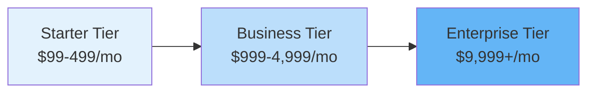

# SaaS Platform Cost Model & Pricing Strategy

## Overview

This document outlines the cost structure, pricing strategy, and financial considerations for operating the multi-tenant SaaS platform on AWS. It covers infrastructure costs, pricing tiers, unit economics, and strategies for profitability.

## Infrastructure Cost Analysis (AWS)

### Monthly Infrastructure Costs by Tenant Tier

#### Enterprise Tier (Dedicated Database)

**Target Customer:** 500+ users, regulated industries, custom requirements

**Infrastructure Components:**

| Component | Specification | Monthly Cost |
|-----------|--------------|--------------|
| **RDS PostgreSQL** | db.r5.xlarge Multi-AZ (4 vCPU, 32GB RAM) | $730 |
| **Read Replica** | db.r5.large (2 vCPU, 16GB RAM) | $365 |
| **Storage** | 500GB gp3 SSD | $115 |
| **Backup Storage** | 500GB (1x database size) | $50 |
| **Data Transfer** | 100GB outbound | $9 |
| **ElastiCache Redis** | cache.r5.large (2 nodes) | $280 |
| **S3 Storage** | 100GB Standard + 500GB IA | $15 |
| **CloudWatch Logs** | 50GB ingestion + storage | $30 |
| **Secrets Manager** | 10 secrets | $4 |
| **Total per Enterprise Tenant** | | **~$1,598/month** |

**Pricing:** $5,000 - $50,000/month  
**Gross Margin:** 68-97%

---

#### Business Tier (Schema per Tenant - Shared DB)

**Target Customer:** 50-500 users, growing companies

**Shared Infrastructure (100 tenants):**

| Component | Specification | Monthly Cost | Per Tenant |
|-----------|--------------|--------------|------------|
| **RDS PostgreSQL** | db.r5.2xlarge Multi-AZ | $1,460 | $14.60 |
| **Storage** | 2TB gp3 SSD | $460 | $4.60 |
| **Backup Storage** | 2TB | $200 | $2.00 |
| **ElastiCache Redis** | cache.r5.xlarge (2 nodes) | $560 | $5.60 |
| **S3 Storage** | 1TB average | $23 | $0.23 |
| **CloudWatch** | Shared monitoring | $200 | $2.00 |
| **Total per Business Tenant** | | | **~$29/month** |

**Pricing:** $500 - $5,000/month  
**Gross Margin:** 94-99%

---

#### Starter Tier (Shared Tables with tenant_id)

**Target Customer:** 1-50 users, small teams

**Shared Infrastructure (1,000 tenants):**

| Component | Specification | Monthly Cost | Per Tenant |
|-----------|--------------|--------------|------------|
| **RDS PostgreSQL** | db.r5.xlarge Multi-AZ | $730 | $0.73 |
| **Storage** | 1TB gp3 SSD | $230 | $0.23 |
| **Backup Storage** | 1TB | $100 | $0.10 |
| **ElastiCache Redis** | cache.r5.large | $140 | $0.14 |
| **S3 Storage** | 500GB average | $12 | $0.01 |
| **CloudWatch** | Shared monitoring | $100 | $0.10 |
| **Total per Starter Tenant** | | | **~$1.31/month** |

**Pricing:** $50 - $500/month  
**Gross Margin:** 97-99%

---

### Shared Platform Costs (All Tiers)

These costs are amortized across all tenants:

| Component | Specification | Monthly Cost |
|-----------|--------------|--------------|
| **EKS Cluster** | Control plane (2 clusters for HA) | $146 |
| **EKS Worker Nodes** | 10x m5.xlarge (4 vCPU, 16GB) | $1,520 |
| **Application Load Balancer** | 2 ALBs | $36 |
| **CloudFront** | 1TB data transfer | $85 |
| **API Gateway** | 100M requests | $350 |
| **Route 53** | Hosted zones + queries | $10 |
| **AWS WAF** | Web ACL + rules | $15 |
| **Cognito** | 50,000 MAU | $275 |
| **OpenSearch** | 2x r5.large.search | $420 |
| **SQS/SNS** | 10M requests | $5 |
| **EventBridge** | 5M events | $5 |
| **Secrets Manager** | 50 secrets | $20 |
| **CloudWatch** | Metrics + dashboards | $150 |
| **X-Ray** | 1M traces | $5 |
| **VPC** | NAT Gateways (2) | $65 |
| **Data Transfer** | Inter-AZ + outbound | $200 |
| **Total Shared Platform** | | **~$3,307/month** |

---

## Pricing Strategy

### Subscription Tiers



### Detailed Pricing Tiers

#### 🚀 Starter - $99/month

**Ideal for:** Small teams, startups, pilot programs

**Includes:**
- Up to 25 users
- 5GB storage
- Core modules: Profile, Skills, Assessments
- Email support (48h response)
- Community access
- Standard security
- Monthly data exports

**Limits:**
- 1,000 assessments/month
- 10 custom skills frameworks
- No API access
- No SSO

**Cost to Serve:** ~$1.31/month  
**Gross Margin:** 99%

---

#### 💼 Business - $999/month

**Ideal for:** Growing companies, departments

**Includes:**
- Up to 100 users ($10/user above 100)
- 50GB storage
- All modules including Teams, Analytics
- Priority email + chat support (24h response)
- API access (10,000 calls/month)
- Basic SSO (SAML)
- Weekly data exports
- Custom branding
- 99.5% SLA

**Limits:**
- 10,000 assessments/month
- 50 custom skills frameworks
- 5 integrations

**Cost to Serve:** ~$29/month  
**Gross Margin:** 97%

---

#### 🏢 Enterprise - Custom (starting at $9,999/month)

**Ideal for:** Large organizations, regulated industries

**Includes:**
- Unlimited users
- Unlimited storage
- Dedicated database
- All modules + custom development
- 24/7 phone + dedicated support
- Unlimited API calls
- Advanced SSO (SAML, OIDC, AD)
- Real-time data exports
- White-label branding
- Custom integrations
- Dedicated account manager
- 99.9% SLA
- Data residency options
- HIPAA/SOC2 compliance

**Cost to Serve:** ~$1,598/month (base)  
**Gross Margin:** 84% (at $10k/mo)

---

## Usage-Based Pricing Components

### Add-Ons & Overages

| Feature | Included | Overage Pricing |
|---------|----------|----------------|
| **Additional Users** | Per tier | $10/user/month (Business)<br/>$15/user/month (Enterprise) |
| **Storage** | Per tier | $0.50/GB/month |
| **API Calls** | Per tier | $1 per 1,000 calls |
| **Assessments** | Per tier | $0.10 per assessment |
| **Custom Integrations** | Enterprise only | $5,000 setup + $500/month |
| **Advanced Analytics** | Enterprise only | $2,000/month |
| **Dedicated Support** | Enterprise only | $3,000/month |
| **Training & Onboarding** | Not included | $5,000 one-time |
| **Data Migration** | Not included | $10,000 one-time |

---

## Unit Economics

### Customer Acquisition Cost (CAC)

**Assumptions:**
- Marketing spend: $50,000/month
- Sales team: 3 reps @ $120k/year + commission
- New customers/month: 20

**CAC Calculation:**
```
Monthly Marketing: $50,000
Monthly Sales Cost: $30,000 (salary) + $10,000 (commission) = $40,000
Total Monthly CAC Spend: $90,000
New Customers: 20

CAC = $90,000 / 20 = $4,500 per customer
```

### Lifetime Value (LTV)

**Starter Tier:**
- ARPU (Average Revenue Per User): $99/month
- Gross Margin: 99%
- Churn Rate: 5%/month
- Average Lifetime: 20 months

```
LTV = ($99 × 0.99 × 20) = $1,960
LTV:CAC = 1,960 / 4,500 = 0.44 ❌ (Not profitable)
```

**Business Tier:**
- ARPU: $999/month (base) + $500 (avg overages) = $1,499/month
- Gross Margin: 97%
- Churn Rate: 2%/month
- Average Lifetime: 50 months

```
LTV = ($1,499 × 0.97 × 50) = $72,652
LTV:CAC = 72,652 / 4,500 = 16.1 ✅ (Excellent)
```

**Enterprise Tier:**
- ARPU: $15,000/month (avg)
- Gross Margin: 85%
- Churn Rate: 0.5%/month
- Average Lifetime: 200 months

```
LTV = ($15,000 × 0.85 × 200) = $2,550,000
LTV:CAC = 2,550,000 / 4,500 = 567 ✅ (Outstanding)
```

### Payback Period

| Tier | Monthly Revenue | CAC | Payback Period |
|------|----------------|-----|----------------|
| Starter | $99 | $4,500 | 46 months ❌ |
| Business | $1,499 | $4,500 | 3 months ✅ |
| Enterprise | $15,000 | $4,500 | 0.3 months ✅ |

**Strategy:** Focus sales efforts on Business and Enterprise tiers. Use Starter as a self-service funnel with minimal sales touch.

---

## Revenue Projections

### Year 1 Projections

**Assumptions:**
- Launch with Starter and Business tiers
- Enterprise tier launches in Month 6
- Monthly growth: 15% MoM

| Month | Starter | Business | Enterprise | MRR | ARR |
|-------|---------|----------|------------|-----|-----|
| 1 | 10 ($990) | 2 ($1,998) | 0 | $2,988 | $35,856 |
| 3 | 15 ($1,485) | 5 ($4,995) | 0 | $6,480 | $77,760 |
| 6 | 25 ($2,475) | 12 ($11,988) | 2 ($30,000) | $44,463 | $533,556 |
| 12 | 50 ($4,950) | 30 ($29,970) | 10 ($150,000) | $184,920 | $2,219,040 |

**Year 1 ARR:** ~$2.2M

### Year 2-3 Projections

| Metric | Year 2 | Year 3 |
|--------|--------|--------|
| **Starter Customers** | 150 | 300 |
| **Business Customers** | 100 | 250 |
| **Enterprise Customers** | 30 | 75 |
| **Total Customers** | 280 | 625 |
| **MRR** | $650,000 | $1,500,000 |
| **ARR** | $7.8M | $18M |

---

## Cost Optimization Strategies

### 1. Reserved Instances & Savings Plans

**Opportunity:**
- RDS Reserved Instances: 40% savings
- EC2 Compute Savings Plans: 30% savings
- ElastiCache Reserved Nodes: 35% savings

**Implementation:**
```
Year 1: Pay-as-you-go (flexibility)
Year 2: 1-year Reserved Instances (predictable workload)
Year 3: 3-year Reserved Instances (maximum savings)

Estimated Savings: 30-40% on compute/database costs
Annual Savings (Year 3): ~$150,000
```

### 2. Auto-Scaling & Right-Sizing

**Strategies:**
- Scale EKS nodes based on CPU/memory utilization
- Use Spot Instances for non-critical workloads (70% savings)
- Right-size RDS instances based on actual usage
- Implement database connection pooling

**Estimated Savings:** 15-20% on infrastructure costs

### 3. Data Storage Optimization

**Strategies:**
- S3 Intelligent-Tiering for automatic cost optimization
- Lifecycle policies: Standard → IA → Glacier
- Compress CloudWatch logs
- Archive old assessment data to Glacier

**Estimated Savings:** 40-60% on storage costs

### 4. CDN & Data Transfer Optimization

**Strategies:**
- Aggressive CloudFront caching (90% cache hit rate)
- Compress assets (gzip/brotli)
- Optimize images (WebP format)
- Use CloudFront Origin Shield

**Estimated Savings:** 30-50% on data transfer costs

### 5. Tenant Consolidation

**Strategy:**
- Monitor Starter tier usage
- Consolidate low-usage tenants to shared infrastructure
- Automatically migrate growing tenants to higher tiers

**Impact:**
- Reduce database count by 30%
- Lower operational overhead

---

## Pricing Experiments & Optimization

### A/B Testing Ideas

1. **Freemium Model**
   - Free tier: 5 users, limited features
   - Conversion rate target: 10% to Starter
   - Hypothesis: Lower barrier increases signups

2. **Annual Billing Discount**
   - Offer: 2 months free (17% discount)
   - Goal: Improve cash flow and reduce churn
   - Target: 40% of customers on annual plans

3. **Usage-Based Pricing**
   - Alternative: $5/user/month + $0.50/assessment
   - Target: High-volume, low-user-count customers
   - Test with 10% of new signups

4. **Tiered Feature Gating**
   - Test: Move API access to Business tier
   - Hypothesis: Increase Business tier conversions
   - Monitor: Churn rate impact

---

## Break-Even Analysis

### Fixed Costs (Monthly)

| Category | Cost |
|----------|------|
| Shared Platform Infrastructure | $3,307 |
| Engineering Team (5 FTEs) | $75,000 |
| Sales & Marketing (4 FTEs) | $50,000 |
| Customer Success (2 FTEs) | $20,000 |
| Operations & Admin | $15,000 |
| **Total Fixed Costs** | **$163,307** |

### Break-Even Calculation

**Scenario 1: Business Tier Focus**
- Average MRR per customer: $1,500
- Gross margin: 97%
- Contribution margin: $1,455

```
Break-even customers = $163,307 / $1,455 = 112 customers
Break-even MRR = $168,000
```

**Scenario 2: Mixed Tiers (Realistic)**
- 50 Starter @ $99 = $4,950 (margin: $4,885)
- 80 Business @ $1,500 = $120,000 (margin: $116,400)
- 5 Enterprise @ $15,000 = $75,000 (margin: $63,750)

```
Total MRR = $199,950
Total Contribution Margin = $185,035
Net Profit = $185,035 - $163,307 = $21,728/month
```

**Break-even: Month 8-10** (with 15% MoM growth)

---

## Financial Metrics & KPIs

### Key Metrics to Track

| Metric | Target | Calculation |
|--------|--------|-------------|
| **MRR** | $1M by Year 2 | Sum of all recurring revenue |
| **ARR** | $12M by Year 2 | MRR × 12 |
| **MRR Growth Rate** | 15% MoM | (Current MRR - Previous MRR) / Previous MRR |
| **Churn Rate** | <2% monthly | Lost MRR / Starting MRR |
| **Net Revenue Retention** | >110% | (Starting MRR + Expansion - Churn) / Starting MRR |
| **CAC** | <$5,000 | Total S&M Spend / New Customers |
| **LTV** | >$50,000 | ARPU × Gross Margin × Avg Lifetime |
| **LTV:CAC** | >10:1 | LTV / CAC |
| **Payback Period** | <6 months | CAC / (Monthly Revenue × Gross Margin) |
| **Gross Margin** | >80% | (Revenue - COGS) / Revenue |
| **Rule of 40** | >40% | Growth Rate % + Profit Margin % |

### Dashboard Metrics

**Revenue Metrics:**
- MRR by tier
- New MRR (new customers)
- Expansion MRR (upgrades, add-ons)
- Churned MRR
- Net New MRR

**Customer Metrics:**
- Total customers by tier
- New customers
- Churned customers
- Customer lifetime (avg)
- ARPU by tier

**Unit Economics:**
- CAC by channel
- LTV by tier
- Payback period
- Gross margin by tier

---

## Competitive Pricing Analysis

### Market Comparison

| Competitor | Starter | Business | Enterprise |
|------------|---------|----------|------------|
| **Our Platform** | $99/mo | $999/mo | $9,999+/mo |
| Degreed | N/A | $12/user/mo | Custom |
| Cornerstone | N/A | $15/user/mo | Custom |
| Skillsoft | N/A | $20/user/mo | Custom |
| EdCast | N/A | $10/user/mo | Custom |

**Positioning:** Mid-market value leader with transparent pricing

---

## Recommendations

### Immediate Actions (Month 1-3)

1. ✅ **Launch with 3 tiers** - Starter, Business, Enterprise
2. ✅ **Implement usage tracking** - Monitor per-tenant costs
3. ✅ **Set up billing automation** - Stripe/Chargebee integration
4. ✅ **Create pricing calculator** - Help customers choose tier
5. ✅ **Enable self-service signup** - For Starter tier only

### Short-Term (Month 4-12)

1. 📊 **Analyze unit economics** - Adjust pricing if needed
2. 🧪 **Run pricing experiments** - Test annual discounts, freemium
3. 📈 **Optimize infrastructure** - Reserved instances, right-sizing
4. 🎯 **Focus on Business tier** - Best LTV:CAC ratio
5. 💰 **Introduce add-ons** - API access, integrations, analytics

### Long-Term (Year 2+)

1. 🌍 **Geographic pricing** - Adjust for different markets
2. 🏢 **Vertical-specific tiers** - Healthcare, Finance, Tech
3. 🤝 **Partner/Reseller program** - 20% commission
4. 📦 **Usage-based option** - For high-volume customers
5. 🚀 **IPO readiness** - Target 70%+ gross margin, Rule of 40

---

## Summary

### Key Takeaways

1. **Infrastructure costs are low** - 1-3% of revenue at scale
2. **Focus on Business & Enterprise** - Best unit economics
3. **Starter tier is a funnel** - Minimize sales touch, automate
4. **Target LTV:CAC >10:1** - Achieved with Business/Enterprise
5. **Break-even at ~110 customers** - Achievable in 8-10 months
6. **Gross margins >80%** - Typical for SaaS, excellent for profitability
7. **Reserved instances critical** - 30-40% cost savings in Year 2+

### Financial Goals

| Metric | Year 1 | Year 2 | Year 3 |
|--------|--------|--------|--------|
| ARR | $2.2M | $7.8M | $18M |
| Customers | 100 | 280 | 625 |
| Gross Margin | 85% | 88% | 90% |
| LTV:CAC | 8:1 | 12:1 | 15:1 |
| Rule of 40 | 50+ | 60+ | 70+ |

**Next Steps:** Review [FRONTEND_OPTIONS.md](file:///Users/rekhasunil/Documents/Sunil/poc-antigravity/saas_platform/docs/FRONTEND_OPTIONS.md) and [BACKEND_OPTIONS.md](file:///Users/rekhasunil/Documents/Sunil/poc-antigravity/saas_platform/docs/BACKEND_OPTIONS.md) for technology decisions.
