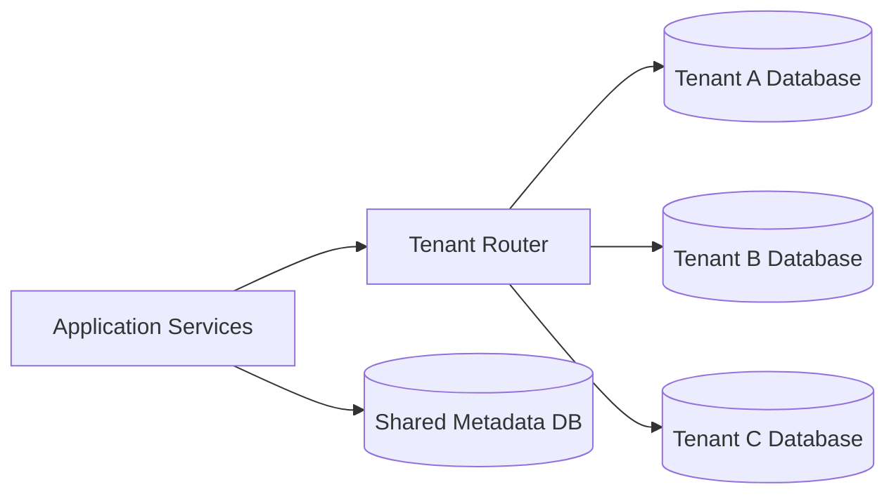
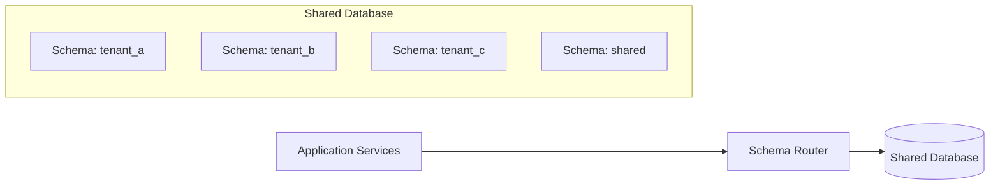
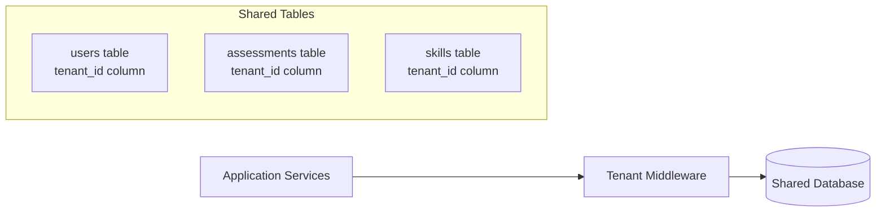
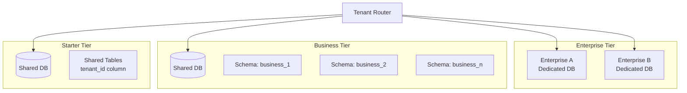
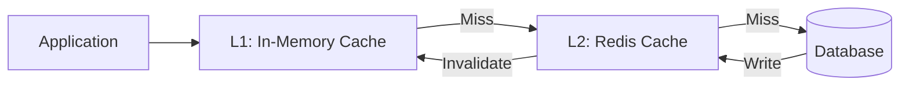

# Multi-Tenant Data Segmentation Strategy

## Overview

This document outlines the data segmentation strategy for the SaaS platform, ensuring complete tenant isolation, optimal performance, and cost-effective scaling. The strategy addresses data architecture, tenant identification, isolation patterns, and database design.

## Multi-Tenancy Models Comparison

### Option 1: Separate Database Per Tenant (Recommended for Enterprise)

**Architecture:**


**Pros:**
- ✅ **Complete isolation** - Maximum security and compliance
- ✅ **Performance isolation** - One tenant can't impact others
- ✅ **Easy backup/restore** per tenant
- ✅ **Simplified compliance** - Data residency requirements
- ✅ **Custom schema** per tenant if needed
- ✅ **Easy tenant migration** or offboarding

**Cons:**
- ❌ **Higher infrastructure costs** - More database instances
- ❌ **Complex management** - Multiple databases to maintain
- ❌ **Resource overhead** - Each DB has minimum resource requirements
- ❌ **Cross-tenant analytics** more complex

**Best For:**
- Enterprise customers (100+ users)
- Regulated industries (healthcare, finance)
- Customers requiring data residency
- High-value customers with SLA requirements

**Cost Estimate:**
- Small tenant: $50-100/month (db.t3.small RDS PostgreSQL)
- Medium tenant: $200-500/month (db.m5.large Multi-AZ)
- Large tenant: $1000+/month (db.r5.xlarge with read replicas)

---

### Option 2: Shared Database with Schema Per Tenant

**Architecture:**


**Pros:**
- ✅ **Good isolation** - Schema-level separation
- ✅ **Lower cost** - Shared infrastructure
- ✅ **Easier management** - Single database instance
- ✅ **Better resource utilization**
- ✅ **Simpler cross-tenant analytics**

**Cons:**
- ❌ **Shared performance** - Noisy neighbor issues
- ❌ **Backup complexity** - Must restore entire DB
- ❌ **Schema limit** - PostgreSQL has practical limits (~1000 schemas)
- ❌ **Migration complexity** - Moving tenants is harder

**Best For:**
- Small to medium businesses (10-100 users)
- Cost-sensitive customers
- Moderate isolation requirements
- Platforms with 100-1000 tenants

**Cost Estimate:**
- Shared database: $500-2000/month for 100 tenants
- Per tenant cost: $5-20/month

---

### Option 3: Shared Database with Tenant ID Column (Row-Level Security)

**Architecture:**


**Pros:**
- ✅ **Lowest cost** - Maximum resource sharing
- ✅ **Simplest management** - Single schema
- ✅ **Easy cross-tenant analytics**
- ✅ **Unlimited tenants** - No schema limits
- ✅ **Simple migrations**

**Cons:**
- ❌ **Weakest isolation** - Application-level only
- ❌ **Security risk** - Query bugs can leak data
- ❌ **Performance issues** - Large tables, complex queries
- ❌ **Compliance challenges** - May not meet requirements

**Best For:**
- Startups and early-stage products
- Small businesses (1-10 users)
- Non-sensitive data
- Platforms with 1000+ small tenants

**Cost Estimate:**
- Shared database: $200-1000/month for 1000 tenants
- Per tenant cost: $0.20-1/month

---

## Recommended Hybrid Approach

### Tiered Multi-Tenancy Strategy



### Tier Definitions

| Tier | Isolation Model | Target Customers | Price Range |
|------|----------------|------------------|-------------|
| **Enterprise** | Dedicated Database | 500+ users, regulated industries | $5,000-50,000/month |
| **Business** | Schema per Tenant | 50-500 users, growing companies | $500-5,000/month |
| **Starter** | Shared Tables (tenant_id) | 1-50 users, small teams | $50-500/month |

### Migration Path
- Start new tenants in **Starter** tier
- Auto-promote to **Business** tier at 50 users or $500/month revenue
- Offer **Enterprise** tier upgrade for compliance/performance needs
- Seamless data migration between tiers

---

## Database Schema Design

### Shared Metadata Database

Stores tenant configuration and routing information.

```sql
-- Tenant registry
CREATE TABLE tenants (
    tenant_id UUID PRIMARY KEY DEFAULT gen_random_uuid(),
    tenant_name VARCHAR(255) NOT NULL UNIQUE,
    tenant_slug VARCHAR(100) NOT NULL UNIQUE,
    isolation_model VARCHAR(50) NOT NULL, -- 'dedicated', 'schema', 'shared'
    database_connection_string TEXT, -- For dedicated databases
    schema_name VARCHAR(100), -- For schema-based isolation
    subscription_tier VARCHAR(50) NOT NULL,
    status VARCHAR(50) NOT NULL DEFAULT 'active',
    created_at TIMESTAMP NOT NULL DEFAULT NOW(),
    updated_at TIMESTAMP NOT NULL DEFAULT NOW(),
    
    -- Billing
    billing_email VARCHAR(255),
    subscription_start_date DATE,
    subscription_end_date DATE,
    
    -- Configuration
    max_users INTEGER,
    max_storage_gb INTEGER,
    features JSONB, -- Feature flags
    
    -- Compliance
    data_residency VARCHAR(50), -- 'us', 'eu', 'apac'
    compliance_requirements JSONB -- ['soc2', 'hipaa', 'gdpr']
);

-- Tenant users (for authentication)
CREATE TABLE tenant_users (
    user_id UUID PRIMARY KEY DEFAULT gen_random_uuid(),
    tenant_id UUID NOT NULL REFERENCES tenants(tenant_id),
    email VARCHAR(255) NOT NULL,
    external_auth_id VARCHAR(255), -- Azure AD object ID
    is_active BOOLEAN DEFAULT true,
    created_at TIMESTAMP NOT NULL DEFAULT NOW(),
    last_login_at TIMESTAMP,
    
    UNIQUE(tenant_id, email)
);

-- Tenant database routing
CREATE TABLE tenant_database_routing (
    tenant_id UUID PRIMARY KEY REFERENCES tenants(tenant_id),
    database_type VARCHAR(50) NOT NULL, -- 'postgresql', 'mysql'
    database_host VARCHAR(255) NOT NULL,
    database_port INTEGER NOT NULL,
    database_name VARCHAR(100) NOT NULL,
    schema_name VARCHAR(100),
    connection_pool_size INTEGER DEFAULT 10,
    read_replica_host VARCHAR(255),
    created_at TIMESTAMP NOT NULL DEFAULT NOW()
);

-- Indexes
CREATE INDEX idx_tenants_slug ON tenants(tenant_slug);
CREATE INDEX idx_tenants_status ON tenants(status);
CREATE INDEX idx_tenant_users_email ON tenant_users(email);
CREATE INDEX idx_tenant_users_tenant ON tenant_users(tenant_id);
```

### Tenant Database Schema (Per-Tenant Data)

**For dedicated databases or schemas:**

```sql
-- Employees/Users
CREATE TABLE employees (
    employee_id UUID PRIMARY KEY DEFAULT gen_random_uuid(),
    email VARCHAR(255) NOT NULL UNIQUE,
    first_name VARCHAR(100) NOT NULL,
    last_name VARCHAR(100) NOT NULL,
    job_title VARCHAR(255),
    department VARCHAR(255),
    manager_id UUID REFERENCES employees(employee_id),
    hire_date DATE,
    status VARCHAR(50) DEFAULT 'active',
    profile_data JSONB,
    created_at TIMESTAMP NOT NULL DEFAULT NOW(),
    updated_at TIMESTAMP NOT NULL DEFAULT NOW()
);

-- Teams
CREATE TABLE teams (
    team_id UUID PRIMARY KEY DEFAULT gen_random_uuid(),
    team_name VARCHAR(255) NOT NULL,
    description TEXT,
    parent_team_id UUID REFERENCES teams(team_id),
    manager_id UUID REFERENCES employees(employee_id),
    created_at TIMESTAMP NOT NULL DEFAULT NOW(),
    updated_at TIMESTAMP NOT NULL DEFAULT NOW()
);

-- Team members
CREATE TABLE team_members (
    team_id UUID REFERENCES teams(team_id),
    employee_id UUID REFERENCES employees(employee_id),
    role VARCHAR(100),
    joined_at TIMESTAMP NOT NULL DEFAULT NOW(),
    PRIMARY KEY (team_id, employee_id)
);

-- Skills
CREATE TABLE skills (
    skill_id UUID PRIMARY KEY DEFAULT gen_random_uuid(),
    skill_name VARCHAR(255) NOT NULL,
    skill_category VARCHAR(100),
    description TEXT,
    framework_id UUID, -- Reference to skills framework
    proficiency_levels JSONB, -- ['beginner', 'intermediate', 'advanced', 'expert']
    created_at TIMESTAMP NOT NULL DEFAULT NOW(),
    updated_at TIMESTAMP NOT NULL DEFAULT NOW()
);

-- Employee skills
CREATE TABLE employee_skills (
    employee_id UUID REFERENCES employees(employee_id),
    skill_id UUID REFERENCES skills(skill_id),
    proficiency_level VARCHAR(50),
    years_of_experience DECIMAL(4,2),
    last_assessed_at TIMESTAMP,
    self_assessed BOOLEAN DEFAULT false,
    verified BOOLEAN DEFAULT false,
    created_at TIMESTAMP NOT NULL DEFAULT NOW(),
    updated_at TIMESTAMP NOT NULL DEFAULT NOW(),
    PRIMARY KEY (employee_id, skill_id)
);

-- Skills frameworks
CREATE TABLE skills_frameworks (
    framework_id UUID PRIMARY KEY DEFAULT gen_random_uuid(),
    framework_name VARCHAR(255) NOT NULL,
    framework_type VARCHAR(100), -- 'SFIA', 'O*NET', 'custom'
    version VARCHAR(50),
    description TEXT,
    framework_data JSONB,
    is_active BOOLEAN DEFAULT true,
    created_at TIMESTAMP NOT NULL DEFAULT NOW(),
    updated_at TIMESTAMP NOT NULL DEFAULT NOW()
);

-- Roles
CREATE TABLE roles (
    role_id UUID PRIMARY KEY DEFAULT gen_random_uuid(),
    role_name VARCHAR(255) NOT NULL,
    role_level VARCHAR(100),
    description TEXT,
    department VARCHAR(255),
    required_skills JSONB, -- Array of {skill_id, min_proficiency}
    created_at TIMESTAMP NOT NULL DEFAULT NOW(),
    updated_at TIMESTAMP NOT NULL DEFAULT NOW()
);

-- Assessments
CREATE TABLE assessments (
    assessment_id UUID PRIMARY KEY DEFAULT gen_random_uuid(),
    assessment_name VARCHAR(255) NOT NULL,
    assessment_type VARCHAR(100), -- 'skills', 'competency', '360'
    description TEXT,
    framework_id UUID REFERENCES skills_frameworks(framework_id),
    status VARCHAR(50) DEFAULT 'draft',
    created_by UUID REFERENCES employees(employee_id),
    questions JSONB,
    scoring_config JSONB,
    created_at TIMESTAMP NOT NULL DEFAULT NOW(),
    updated_at TIMESTAMP NOT NULL DEFAULT NOW()
);

-- Assessment results
CREATE TABLE assessment_results (
    result_id UUID PRIMARY KEY DEFAULT gen_random_uuid(),
    assessment_id UUID REFERENCES assessments(assessment_id),
    employee_id UUID REFERENCES employees(employee_id),
    started_at TIMESTAMP,
    completed_at TIMESTAMP,
    status VARCHAR(50) DEFAULT 'in_progress',
    answers JSONB,
    score DECIMAL(5,2),
    results_data JSONB,
    created_at TIMESTAMP NOT NULL DEFAULT NOW()
);

-- Certifications
CREATE TABLE certifications (
    certification_id UUID PRIMARY KEY DEFAULT gen_random_uuid(),
    employee_id UUID REFERENCES employees(employee_id),
    certification_name VARCHAR(255) NOT NULL,
    issuing_organization VARCHAR(255),
    issue_date DATE,
    expiry_date DATE,
    credential_id VARCHAR(255),
    credential_url TEXT,
    verification_status VARCHAR(50),
    created_at TIMESTAMP NOT NULL DEFAULT NOW()
);

-- Indexes for performance
CREATE INDEX idx_employees_email ON employees(email);
CREATE INDEX idx_employees_status ON employees(status);
CREATE INDEX idx_employees_manager ON employees(manager_id);
CREATE INDEX idx_teams_parent ON teams(parent_team_id);
CREATE INDEX idx_employee_skills_employee ON employee_skills(employee_id);
CREATE INDEX idx_employee_skills_skill ON employee_skills(skill_id);
CREATE INDEX idx_assessment_results_employee ON assessment_results(employee_id);
CREATE INDEX idx_assessment_results_assessment ON assessment_results(assessment_id);
```

### Shared Tables Schema (for Starter Tier)

**Add tenant_id to every table:**

```sql
CREATE TABLE employees (
    employee_id UUID PRIMARY KEY DEFAULT gen_random_uuid(),
    tenant_id UUID NOT NULL, -- Added for multi-tenancy
    email VARCHAR(255) NOT NULL,
    -- ... other fields
    
    UNIQUE(tenant_id, email)
);

-- Row-Level Security (PostgreSQL)
ALTER TABLE employees ENABLE ROW LEVEL SECURITY;

CREATE POLICY tenant_isolation_policy ON employees
    USING (tenant_id = current_setting('app.current_tenant')::UUID);

-- Indexes must include tenant_id
CREATE INDEX idx_employees_tenant_email ON employees(tenant_id, email);
CREATE INDEX idx_employees_tenant_status ON employees(tenant_id, status);
```

---

## Tenant Identification & Routing

### 1. Subdomain-Based Identification

**URL Pattern:** `https://{tenant-slug}.platform.com`

**Pros:**
- Clear tenant separation
- Easy to remember
- Professional appearance
- Supports custom domains

**Implementation:**
```javascript
// Middleware to extract tenant from subdomain
function extractTenantFromSubdomain(req) {
    const host = req.headers.host;
    const subdomain = host.split('.')[0];
    
    // Lookup tenant in shared metadata DB
    const tenant = await getTenantBySlug(subdomain);
    
    if (!tenant) {
        throw new Error('Tenant not found');
    }
    
    // Set tenant context for request
    req.tenant = tenant;
    return tenant;
}
```

### 2. Header-Based Identification

**Header:** `X-Tenant-ID: {tenant-id}`

**Pros:**
- Flexible for API clients
- Works with single domain
- Easy for integrations

**Implementation:**
```javascript
function extractTenantFromHeader(req) {
    const tenantId = req.headers['x-tenant-id'];
    
    if (!tenantId) {
        throw new Error('Tenant ID header required');
    }
    
    const tenant = await getTenantById(tenantId);
    req.tenant = tenant;
    return tenant;
}
```

### 3. JWT Token-Based Identification

**Token Claim:** `"tenant_id": "{tenant-id}"`

**Pros:**
- Secure
- No additional lookup needed
- Works for authenticated requests

**Implementation:**
```javascript
function extractTenantFromToken(req) {
    const token = extractJWT(req);
    const decoded = verifyJWT(token);
    
    const tenantId = decoded.tenant_id;
    const tenant = await getTenantById(tenantId);
    
    req.tenant = tenant;
    return tenant;
}
```

---

## Database Connection Pooling

### Connection Pool Strategy

```javascript
class TenantDatabaseManager {
    constructor() {
        this.pools = new Map(); // tenant_id -> connection pool
        this.sharedPool = null; // For shared database
    }
    
    async getConnection(tenant) {
        if (tenant.isolation_model === 'dedicated') {
            return this.getDedicatedConnection(tenant);
        } else if (tenant.isolation_model === 'schema') {
            return this.getSchemaConnection(tenant);
        } else {
            return this.getSharedConnection(tenant);
        }
    }
    
    async getDedicatedConnection(tenant) {
        if (!this.pools.has(tenant.tenant_id)) {
            // Create new pool for this tenant
            const pool = new Pool({
                host: tenant.database_host,
                port: tenant.database_port,
                database: tenant.database_name,
                user: process.env.DB_USER,
                password: process.env.DB_PASSWORD,
                max: 10, // Max connections per tenant
                idleTimeoutMillis: 30000,
                connectionTimeoutMillis: 2000,
            });
            
            this.pools.set(tenant.tenant_id, pool);
        }
        
        return this.pools.get(tenant.tenant_id);
    }
    
    async getSchemaConnection(tenant) {
        if (!this.sharedPool) {
            this.sharedPool = new Pool({
                host: process.env.SHARED_DB_HOST,
                database: process.env.SHARED_DB_NAME,
                max: 100, // Larger pool for shared DB
            });
        }
        
        const client = await this.sharedPool.connect();
        
        // Set schema for this session
        await client.query(`SET search_path TO ${tenant.schema_name}`);
        
        return client;
    }
    
    async getSharedConnection(tenant) {
        if (!this.sharedPool) {
            this.sharedPool = new Pool({
                host: process.env.SHARED_DB_HOST,
                database: process.env.SHARED_DB_NAME,
                max: 100,
            });
        }
        
        const client = await this.sharedPool.connect();
        
        // Set tenant context for RLS
        await client.query(
            `SET app.current_tenant = '${tenant.tenant_id}'`
        );
        
        return client;
    }
}
```

---

## Data Migration Between Tiers

### Starter → Business Tier Migration

```sql
-- 1. Create new schema for tenant
CREATE SCHEMA tenant_abc123;

-- 2. Create tables in new schema
SET search_path TO tenant_abc123;
-- Run table creation scripts

-- 3. Migrate data from shared tables
INSERT INTO tenant_abc123.employees
SELECT employee_id, email, first_name, last_name, ...
FROM public.employees
WHERE tenant_id = 'abc123';

-- 4. Update tenant record
UPDATE tenants
SET isolation_model = 'schema',
    schema_name = 'tenant_abc123'
WHERE tenant_id = 'abc123';

-- 5. Delete data from shared tables
DELETE FROM public.employees WHERE tenant_id = 'abc123';
```

### Business → Enterprise Tier Migration

```bash
# 1. Create new dedicated RDS instance
aws rds create-db-instance \
    --db-instance-identifier tenant-abc123-db \
    --db-instance-class db.t3.medium \
    --engine postgres \
    --engine-version 15.4 \
    --master-username admin \
    --master-user-password "${DB_PASSWORD}" \
    --allocated-storage 100 \
    --storage-encrypted \
    --backup-retention-period 7 \
    --vpc-security-group-ids sg-xxxxx \
    --db-subnet-group-name saas-platform-db-subnet

# 2. Wait for instance to be available
aws rds wait db-instance-available \
    --db-instance-identifier tenant-abc123-db

# 3. Export schema data
pg_dump -h shared-db.xxxxx.us-east-1.rds.amazonaws.com \
    -U admin \
    -n tenant_abc123 \
    -F c \
    -f tenant_abc123_backup.dump

# 4. Restore to dedicated database
pg_restore -h tenant-abc123-db.xxxxx.us-east-1.rds.amazonaws.com \
    -U admin \
    -d postgres \
    tenant_abc123_backup.dump

# 5. Update tenant routing
UPDATE tenant_database_routing
SET database_host = 'tenant-abc123-db.xxxxx.us-east-1.rds.amazonaws.com',
    database_name = 'postgres',
    schema_name = 'public'
WHERE tenant_id = 'abc123';

# 6. Drop schema from shared database
DROP SCHEMA tenant_abc123 CASCADE;
```

---

## Performance Optimization

### Caching Strategy



**Cache Layers:**
1. **L1 (In-Memory):** Tenant metadata, frequently accessed skills
2. **L2 (Redis):** User profiles, assessment results, team structures
3. **Database:** Source of truth

**Cache Keys:**
```
tenant:{tenant_id}:employee:{employee_id}
tenant:{tenant_id}:skills:list
tenant:{tenant_id}:team:{team_id}:members
```

### Database Optimization

**Partitioning for Shared Tables:**
```sql
-- Partition by tenant_id for large shared tables
CREATE TABLE assessment_results (
    result_id UUID,
    tenant_id UUID NOT NULL,
    -- other fields
) PARTITION BY HASH (tenant_id);

CREATE TABLE assessment_results_p0 PARTITION OF assessment_results
    FOR VALUES WITH (MODULUS 4, REMAINDER 0);
CREATE TABLE assessment_results_p1 PARTITION OF assessment_results
    FOR VALUES WITH (MODULUS 4, REMAINDER 1);
-- etc.
```

**Materialized Views for Analytics:**
```sql
CREATE MATERIALIZED VIEW tenant_skills_summary AS
SELECT 
    tenant_id,
    skill_id,
    COUNT(DISTINCT employee_id) as employee_count,
    AVG(CASE proficiency_level 
        WHEN 'expert' THEN 4
        WHEN 'advanced' THEN 3
        WHEN 'intermediate' THEN 2
        WHEN 'beginner' THEN 1
    END) as avg_proficiency
FROM employee_skills
GROUP BY tenant_id, skill_id;

-- Refresh periodically
REFRESH MATERIALIZED VIEW CONCURRENTLY tenant_skills_summary;
```

---

## Security & Compliance

### Data Encryption

- **At Rest:** AES-256 encryption for all databases
- **In Transit:** TLS 1.3 for all connections
- **Application-Level:** Encrypt sensitive fields (SSN, salary)

### Audit Logging

```sql
CREATE TABLE audit_log (
    log_id UUID PRIMARY KEY DEFAULT gen_random_uuid(),
    tenant_id UUID NOT NULL,
    user_id UUID NOT NULL,
    action VARCHAR(100) NOT NULL,
    resource_type VARCHAR(100) NOT NULL,
    resource_id UUID,
    ip_address INET,
    user_agent TEXT,
    request_data JSONB,
    response_status INTEGER,
    created_at TIMESTAMP NOT NULL DEFAULT NOW()
);

-- Partition by month for performance
CREATE TABLE audit_log_2025_01 PARTITION OF audit_log
    FOR VALUES FROM ('2025-01-01') TO ('2025-02-01');
```

### Data Residency

```sql
-- Tenant configuration for data residency
UPDATE tenants
SET data_residency = 'eu',
    compliance_requirements = '["gdpr", "iso27001"]'
WHERE tenant_id = 'abc123';

-- Route to EU-specific database
UPDATE tenant_database_routing
SET database_host = 'eu-west-db.postgres.database.azure.com'
WHERE tenant_id = 'abc123';
```

---

## Backup & Recovery

### Backup Strategy by Tier

| Tier | Backup Frequency | Retention | PITR | Geo-Redundancy |
|------|-----------------|-----------|------|----------------|
| **Enterprise** | Continuous | 35 days | Yes | Yes |
| **Business** | Daily | 14 days | Yes | Optional |
| **Starter** | Daily | 7 days | No | No |

### Automated Backup Script

```bash
#!/bin/bash
# backup-tenant-database.sh

TENANT_ID=$1
BACKUP_DIR="/backups/${TENANT_ID}"
TIMESTAMP=$(date +%Y%m%d_%H%M%S)
S3_BUCKET="saas-platform-backups"

# Get tenant database info
DB_INFO=$(psql -h metadata-db -U admin -t -c \
    "SELECT database_host, database_name FROM tenant_database_routing WHERE tenant_id='${TENANT_ID}'")

DB_HOST=$(echo $DB_INFO | awk '{print $1}')
DB_NAME=$(echo $DB_INFO | awk '{print $2}')

# Create backup
pg_dump -h $DB_HOST -U admin -d $DB_NAME \
    -F c -f "${BACKUP_DIR}/backup_${TIMESTAMP}.dump"

# Upload to S3 with encryption
aws s3 cp "${BACKUP_DIR}/backup_${TIMESTAMP}.dump" \
    "s3://${S3_BUCKET}/tenant-backups/${TENANT_ID}/backup_${TIMESTAMP}.dump" \
    --server-side-encryption AES256 \
    --storage-class STANDARD_IA

# Clean up local backup
rm "${BACKUP_DIR}/backup_${TIMESTAMP}.dump"
```

---

## Monitoring & Alerting

### Key Metrics by Tenant

```sql
-- Tenant resource usage
SELECT 
    t.tenant_id,
    t.tenant_name,
    COUNT(DISTINCT e.employee_id) as user_count,
    COUNT(DISTINCT ar.result_id) as assessment_count,
    pg_database_size(tdr.database_name) as database_size_bytes
FROM tenants t
LEFT JOIN employees e ON e.tenant_id = t.tenant_id
LEFT JOIN assessment_results ar ON ar.tenant_id = t.tenant_id
LEFT JOIN tenant_database_routing tdr ON tdr.tenant_id = t.tenant_id
GROUP BY t.tenant_id, t.tenant_name, tdr.database_name;
```

### Alerts

- Database size > 80% of tier limit
- Connection pool exhaustion
- Query performance degradation
- Failed tenant migrations
- Unusual data access patterns

---

## Summary & Recommendations

### Recommended Approach

1. **Start with Hybrid Model:**
   - Starter tier: Shared tables with tenant_id
   - Business tier: Schema per tenant
   - Enterprise tier: Dedicated databases

2. **Implement Tenant Router:**
   - Automatic routing based on tenant tier
   - Connection pooling per isolation model
   - Transparent to application code

3. **Plan for Growth:**
   - Automated tier upgrades based on usage
   - Seamless data migration scripts
   - Performance monitoring per tenant

4. **Security First:**
   - Row-level security for shared tables
   - Encrypted connections and data at rest
   - Comprehensive audit logging

5. **Cost Optimization:**
   - Right-size databases per tenant
   - Auto-scaling for shared resources
   - Reserved instances for predictable workloads

### Next Steps

1. Review [COST_MODEL.md](file:///Users/rekhasunil/Documents/Sunil/poc-antigravity/saas_platform/docs/COST_MODEL.md) for pricing strategy
2. See [DATABASE_SCHEMA.md](file:///Users/rekhasunil/Documents/Sunil/poc-antigravity/saas_platform/docs/DATABASE_SCHEMA.md) for complete schema
3. Check [SECURITY.md](file:///Users/rekhasunil/Documents/Sunil/poc-antigravity/saas_platform/docs/SECURITY.md) for security implementation
