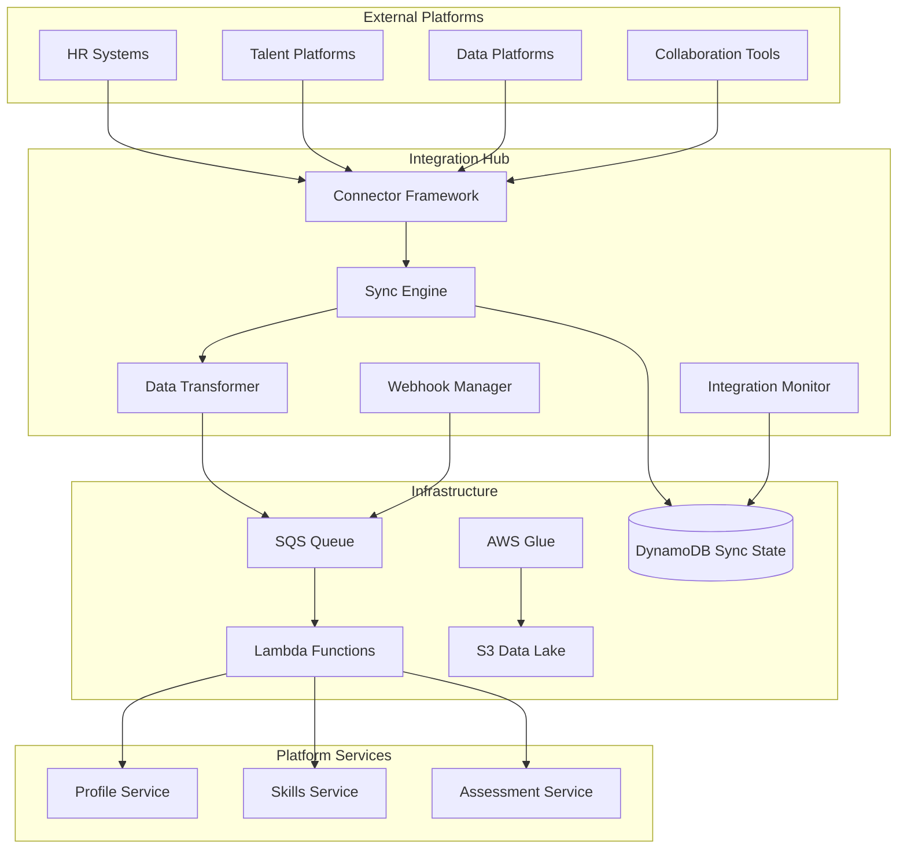
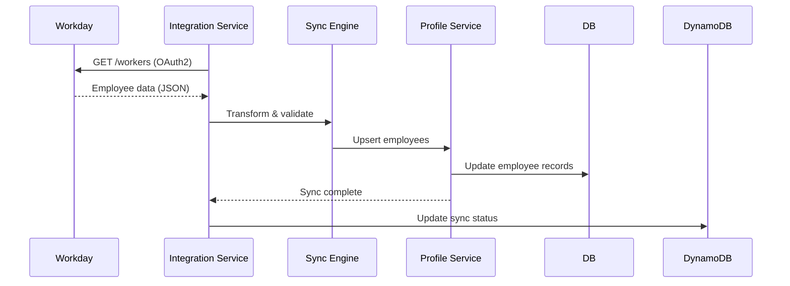
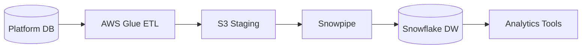

# Enterprise Integrations Guide

## Overview

This document details the integration capabilities of the SaaS platform, focusing on enterprise-grade connectivity with HR systems, talent management platforms, and data platforms. The integrations module enables seamless data flow between the skills platform and existing enterprise systems.

## Integration Architecture

### Integration Service Components



---

## HR Information Systems (HRIS) Integrations

### 1. Workday Integration

**Use Cases:**
- Employee profile synchronization
- Organizational structure import
- Job role and title mapping
- Compensation data (optional)

**Integration Method:** REST API + OAuth2

**Data Flow:**


**Configuration:**
```json
{
  "integration_type": "workday",
  "auth": {
    "type": "oauth2",
    "client_id": "{{WORKDAY_CLIENT_ID}}",
    "client_secret": "{{WORKDAY_CLIENT_SECRET}}",
    "token_url": "https://{{tenant}}.workday.com/ccx/oauth2/token",
    "scope": "worker:read organization:read"
  },
  "endpoints": {
    "workers": "/ccx/api/v1/{{tenant}}/workers",
    "organizations": "/ccx/api/v1/{{tenant}}/organizations"
  },
  "sync_schedule": "0 2 * * *",
  "field_mapping": {
    "workday_id": "employee_id",
    "legal_name": "full_name",
    "email": "email",
    "job_title": "job_title",
    "organization": "department",
    "manager_id": "manager_id"
  }
}
```

**API Endpoints:**
- `POST /api/v1/integrations/workday/connect`
- `POST /api/v1/integrations/workday/sync`
- `GET /api/v1/integrations/workday/status`
- `DELETE /api/v1/integrations/workday/disconnect`

---

### 2. SAP SuccessFactors Integration

**Use Cases:**
- Performance review data import
- Learning & development records
- Succession planning data
- Goal alignment

**Integration Method:** OData API + OAuth2

**Data Entities:**
- `User` - Employee master data
- `PerformanceReview` - Performance ratings
- `Goal` - Employee goals
- `CompetencyRating` - Competency assessments

**Configuration:**
```json
{
  "integration_type": "sap_successfactors",
  "auth": {
    "type": "oauth2",
    "api_url": "https://{{datacenter}}.successfactors.com",
    "company_id": "{{COMPANY_ID}}",
    "client_id": "{{SF_CLIENT_ID}}",
    "client_secret": "{{SF_CLIENT_SECRET}}"
  },
  "entities": [
    {
      "name": "User",
      "odata_path": "/odata/v2/User",
      "sync_mode": "full",
      "schedule": "0 3 * * *"
    },
    {
      "name": "CompetencyRating",
      "odata_path": "/odata/v2/CompetencyRating",
      "sync_mode": "incremental",
      "schedule": "0 */6 * * *"
    }
  ]
}
```

---

### 3. Oracle HCM Cloud Integration

**Use Cases:**
- Workforce demographics
- Compensation and benefits
- Talent profiles
- Career development plans

**Integration Method:** REST API + Basic Auth

**Key APIs:**
- `/hcmRestApi/resources/11.13.18.05/workers`
- `/hcmRestApi/resources/11.13.18.05/talentProfiles`
- `/hcmRestApi/resources/11.13.18.05/careerDevelopment`

---

### 4. ADP Workforce Now Integration

**Use Cases:**
- Payroll-linked employee data
- Time and attendance
- Benefits enrollment
- Onboarding status

**Integration Method:** ADP Marketplace API + OAuth2

**Configuration:**
```json
{
  "integration_type": "adp_workforce_now",
  "auth": {
    "type": "oauth2",
    "client_id": "{{ADP_CLIENT_ID}}",
    "client_secret": "{{ADP_CLIENT_SECRET}}",
    "token_url": "https://accounts.adp.com/auth/oauth/v2/token",
    "api_url": "https://api.adp.com"
  },
  "endpoints": {
    "workers": "/hr/v2/workers"
  },
  "sync_schedule": "0 4 * * *"
}
```

---

### 5. BambooHR Integration

**Use Cases:**
- Small to mid-size company HR data
- Employee onboarding workflows
- Time-off tracking
- Employee directory

**Integration Method:** REST API + API Key

**Configuration:**
```json
{
  "integration_type": "bamboohr",
  "auth": {
    "type": "api_key",
    "subdomain": "{{BAMBOO_SUBDOMAIN}}",
    "api_key": "{{BAMBOO_API_KEY}}"
  },
  "endpoints": {
    "employees": "/api/gateway.php/{{subdomain}}/v1/employees/directory",
    "employee_detail": "/api/gateway.php/{{subdomain}}/v1/employees/{id}"
  }
}
```

---

## Talent Management Platform Integrations

### 1. Cornerstone OnDemand Integration

**Use Cases:**
- Learning course completions
- Certification tracking
- Skills assessments from LMS
- Training recommendations

**Integration Method:** xAPI (Experience API) + REST API

**xAPI Statement Example:**
```json
{
  "actor": {
    "mbox": "mailto:employee@company.com",
    "name": "John Doe"
  },
  "verb": {
    "id": "http://adlnet.gov/expapi/verbs/completed",
    "display": {"en-US": "completed"}
  },
  "object": {
    "id": "http://company.com/courses/python-advanced",
    "definition": {
      "name": {"en-US": "Advanced Python Programming"},
      "type": "http://adlnet.gov/expapi/activities/course"
    }
  },
  "result": {
    "score": {"scaled": 0.95},
    "success": true,
    "completion": true
  }
}
```

**Webhook Configuration:**
```json
{
  "integration_type": "cornerstone",
  "webhook_url": "https://api.platform.com/webhooks/cornerstone",
  "events": [
    "course.completed",
    "certification.earned",
    "assessment.submitted"
  ],
  "auth": {
    "type": "hmac_sha256",
    "secret": "{{WEBHOOK_SECRET}}"
  }
}
```

---

### 2. Degreed Integration

**Use Cases:**
- Skills tracking and validation
- Learning pathways
- Content recommendations
- Skills gap analysis

**Integration Method:** REST API + OAuth2

**API Endpoints:**
- `GET /api/v2/users/{id}/skills`
- `GET /api/v2/users/{id}/completions`
- `POST /api/v2/skills/validate`

**Configuration:**
```json
{
  "integration_type": "degreed",
  "auth": {
    "type": "oauth2",
    "client_id": "{{DEGREED_CLIENT_ID}}",
    "client_secret": "{{DEGREED_CLIENT_SECRET}}",
    "api_url": "https://api.degreed.com"
  },
  "sync": {
    "skills": {
      "direction": "bidirectional",
      "schedule": "0 */4 * * *"
    },
    "completions": {
      "direction": "inbound",
      "schedule": "0 */2 * * *"
    }
  }
}
```

---

### 3. LinkedIn Learning Integration

**Use Cases:**
- Course completion tracking
- Skills from learning paths
- Recommended courses
- Learning analytics

**Integration Method:** OAuth2 + REST API

**Configuration:**
```json
{
  "integration_type": "linkedin_learning",
  "auth": {
    "type": "oauth2",
    "client_id": "{{LINKEDIN_CLIENT_ID}}",
    "client_secret": "{{LINKEDIN_CLIENT_SECRET}}",
    "scope": "r_liteprofile r_learning_content"
  },
  "endpoints": {
    "learner_activity": "/v2/learnerActivity",
    "courses": "/v2/learningAssets"
  }
}
```

---

### 4. Udemy Business Integration

**Use Cases:**
- Corporate training completions
- Skills from course catalog
- Learning analytics
- Custom course assignments

**Integration Method:** REST API + API Key

---

### 5. Pluralsight Integration

**Use Cases:**
- Technical skills assessments
- Skill IQ scores
- Role IQ assessments
- Learning paths for tech roles

**Integration Method:** REST API + OAuth2

---

## Data Platform Integrations

### 1. Snowflake Integration

**Use Cases:**
- Skills data warehouse export
- Advanced analytics and ML
- Historical trend analysis
- Cross-platform data joins

**Integration Method:** Snowflake Connector + SQL

**Architecture:**


**ETL Configuration:**
```python
# AWS Glue job for Snowflake export
import sys
from awsglue.transforms import *
from awsglue.utils import getResolvedOptions
from pyspark.context import SparkContext
from awsglue.context import GlueContext
from awsglue.job import Job

# Read from RDS PostgreSQL
datasource = glueContext.create_dynamic_frame.from_catalog(
    database="saas_platform",
    table_name="employee_skills"
)

# Transform
transformed = ApplyMapping.apply(
    frame=datasource,
    mappings=[
        ("employee_id", "string", "employee_id", "string"),
        ("skill_id", "string", "skill_id", "string"),
        ("proficiency_level", "string", "proficiency_level", "string"),
        ("last_assessed_at", "timestamp", "last_assessed_at", "timestamp")
    ]
)

# Write to S3 (Snowflake external stage)
glueContext.write_dynamic_frame.from_options(
    frame=transformed,
    connection_type="s3",
    connection_options={
        "path": "s3://snowflake-stage/skills-platform/employee_skills/"
    },
    format="parquet"
)
```

**Snowflake Configuration:**
```sql
-- Create external stage
CREATE STAGE skills_platform_stage
  URL = 's3://snowflake-stage/skills-platform/'
  CREDENTIALS = (AWS_KEY_ID='xxx' AWS_SECRET_KEY='xxx');

-- Create table
CREATE TABLE employee_skills (
  employee_id VARCHAR,
  skill_id VARCHAR,
  proficiency_level VARCHAR,
  last_assessed_at TIMESTAMP
);

-- Create pipe for auto-ingestion
CREATE PIPE employee_skills_pipe
  AUTO_INGEST = TRUE
  AS
  COPY INTO employee_skills
  FROM @skills_platform_stage/employee_skills/
  FILE_FORMAT = (TYPE = PARQUET);
```

---

### 2. Databricks Integration

**Use Cases:**
- Machine learning on skills data
- Predictive analytics (skills gaps, attrition)
- Advanced reporting
- Data science workflows

**Integration Method:** Delta Lake + Spark Connector

**Configuration:**
```python
# Databricks notebook for skills analytics
from pyspark.sql import SparkSession

# Read from S3 (Delta Lake format)
skills_df = spark.read.format("delta").load("s3://data-lake/skills/employee_skills")

# ML model for skills gap prediction
from pyspark.ml.classification import RandomForestClassifier
from pyspark.ml.feature import VectorAssembler

# Feature engineering
assembler = VectorAssembler(
    inputCols=["years_experience", "assessment_score", "training_hours"],
    outputCol="features"
)

# Train model
rf = RandomForestClassifier(labelCol="proficiency_level", featuresCol="features")
model = rf.fit(training_data)

# Write predictions back to S3
predictions.write.format("delta").mode("overwrite").save("s3://data-lake/skills/predictions")
```

---

### 3. Power BI Integration

**Use Cases:**
- Embedded dashboards in platform
- Executive reporting
- Skills analytics visualization
- Custom report builder

**Integration Method:** Power BI Embedded API + REST API

**Embedded Dashboard:**
```javascript
// Embed Power BI report in platform
const embedConfig = {
  type: 'report',
  id: 'skills-dashboard-report-id',
  embedUrl: 'https://app.powerbi.com/reportEmbed',
  accessToken: powerBIAccessToken,
  tokenType: models.TokenType.Embed,
  settings: {
    filterPaneEnabled: false,
    navContentPaneEnabled: true,
    background: models.BackgroundType.Transparent
  },
  filters: [
    {
      $schema: "http://powerbi.com/product/schema#basic",
      target: {
        table: "Employees",
        column: "TenantId"
      },
      operator: "In",
      values: [currentTenantId]
    }
  ]
};

powerbi.embed(reportContainer, embedConfig);
```

---

### 4. Tableau Integration

**Use Cases:**
- Interactive visualizations
- Skills heatmaps
- Team competency matrices
- Trend analysis

**Integration Method:** Hyper API + Web Data Connector

**Hyper API Export:**
```python
from tableauhyperapi import HyperProcess, Connection, TableDefinition, \
    SqlType, Inserter, CreateMode, TableName

# Define table schema
skills_table = TableDefinition(
    table_name=TableName("Extract", "EmployeeSkills"),
    columns=[
        TableDefinition.Column("EmployeeId", SqlType.text()),
        TableDefinition.Column("SkillName", SqlType.text()),
        TableDefinition.Column("ProficiencyLevel", SqlType.text()),
        TableDefinition.Column("YearsExperience", SqlType.double()),
        TableDefinition.Column("LastAssessed", SqlType.date())
    ]
)

# Create Hyper file
with HyperProcess(Telemetry.SEND_USAGE_DATA_TO_TABLEAU) as hyper:
    with Connection(hyper.endpoint, 'skills_data.hyper', CreateMode.CREATE_AND_REPLACE) as connection:
        connection.catalog.create_table(skills_table)
        
        # Insert data
        with Inserter(connection, skills_table) as inserter:
            for row in employee_skills_data:
                inserter.add_row(row)
            inserter.execute()
```

---

### 5. Looker Integration

**Use Cases:**
- Embedded analytics
- Custom metrics and KPIs
- Self-service reporting
- Data exploration

**Integration Method:** Looker Embedded SDK + API

---

## Collaboration Platform Integrations

### 1. Microsoft Teams Integration

**Use Cases:**
- Assessment notifications
- Skills endorsements via bot
- Team skills dashboard tab
- Workflow approvals

**Integration Method:** Teams Bot Framework + Graph API

**Bot Configuration:**
```json
{
  "integration_type": "microsoft_teams",
  "bot": {
    "app_id": "{{TEAMS_APP_ID}}",
    "app_password": "{{TEAMS_APP_PASSWORD}}",
    "messaging_endpoint": "https://api.platform.com/webhooks/teams"
  },
  "notifications": [
    "assessment.assigned",
    "assessment.completed",
    "skill.endorsed",
    "certification.expiring"
  ],
  "commands": [
    "/skills view",
    "/skills endorse @user",
    "/assessment start"
  ]
}
```

---

### 2. Slack Integration

**Use Cases:**
- Real-time notifications
- Slash commands for skills lookup
- Skills bot for Q&A
- Workflow automation

**Integration Method:** Slack App + Events API

**Slash Commands:**
- `/skills @user` - View user's skills
- `/assess create` - Create new assessment
- `/skills-gap team` - View team skills gap

---

## Integration Patterns & Best Practices

### 1. Sync Strategies

**Full Sync:**
- Initial setup or data recovery
- Scheduled during off-peak hours
- Complete data replacement

**Incremental Sync:**
- Regular updates (hourly/daily)
- Only changed records
- Uses timestamps or change tokens

**Real-Time Sync:**
- Webhook-driven
- Immediate updates
- For critical data (user provisioning)

### 2. Error Handling

```javascript
class IntegrationSyncService {
  async syncWithRetry(integration, maxRetries = 3) {
    let attempt = 0;
    
    while (attempt < maxRetries) {
      try {
        const result = await this.performSync(integration);
        await this.updateSyncStatus(integration.id, 'success', result);
        return result;
      } catch (error) {
        attempt++;
        
        if (attempt >= maxRetries) {
          await this.updateSyncStatus(integration.id, 'failed', {
            error: error.message,
            attempts: attempt
          });
          await this.notifyAdmins(integration, error);
          throw error;
        }
        
        // Exponential backoff
        const delay = Math.pow(2, attempt) * 1000;
        await this.sleep(delay);
      }
    }
  }
}
```

### 3. Data Transformation

```javascript
class DataTransformer {
  transformWorkdayEmployee(workdayData) {
    return {
      employee_id: workdayData.Worker_ID,
      email: workdayData.Email_Address,
      first_name: workdayData.Legal_Name_First,
      last_name: workdayData.Legal_Name_Last,
      job_title: workdayData.Business_Title,
      department: workdayData.Organization_Name,
      manager_id: workdayData.Manager_ID,
      hire_date: this.parseDate(workdayData.Hire_Date),
      status: this.mapStatus(workdayData.Active_Status)
    };
  }
  
  mapStatus(workdayStatus) {
    const statusMap = {
      'Active': 'active',
      'Leave': 'on_leave',
      'Terminated': 'inactive'
    };
    return statusMap[workdayStatus] || 'unknown';
  }
}
```

### 4. Rate Limiting

```javascript
class RateLimiter {
  constructor(maxRequests, timeWindow) {
    this.maxRequests = maxRequests;
    this.timeWindow = timeWindow; // in milliseconds
    this.requests = [];
  }
  
  async throttle() {
    const now = Date.now();
    this.requests = this.requests.filter(time => now - time < this.timeWindow);
    
    if (this.requests.length >= this.maxRequests) {
      const oldestRequest = this.requests[0];
      const waitTime = this.timeWindow - (now - oldestRequest);
      await this.sleep(waitTime);
    }
    
    this.requests.push(now);
  }
}

// Usage
const workdayLimiter = new RateLimiter(100, 60000); // 100 requests per minute
await workdayLimiter.throttle();
const data = await workdayAPI.getEmployees();
```

---

## Integration Marketplace

### Self-Service Integration Setup

**Admin UI Flow:**
1. Browse integration marketplace
2. Select integration (e.g., Workday)
3. Provide credentials (OAuth or API key)
4. Configure field mappings
5. Set sync schedule
6. Test connection
7. Activate integration

**Integration Card Example:**
```json
{
  "id": "workday-hris",
  "name": "Workday",
  "category": "HRIS",
  "description": "Sync employee data from Workday",
  "logo_url": "https://cdn.platform.com/integrations/workday.png",
  "tier_availability": ["business", "enterprise"],
  "setup_complexity": "medium",
  "estimated_setup_time": "30 minutes",
  "auth_methods": ["oauth2"],
  "data_sync": {
    "entities": ["employees", "organizations", "positions"],
    "directions": ["inbound"],
    "frequencies": ["hourly", "daily", "weekly"]
  },
  "pricing": {
    "setup_fee": 0,
    "monthly_fee": 500,
    "included_in_enterprise": true
  }
}
```

---

## Monitoring & Observability

### Integration Health Dashboard

**Metrics to Track:**
- Sync success rate
- Average sync duration
- API error rates
- Data quality issues
- Record counts synced

**CloudWatch Metrics:**
```javascript
// Publish custom metrics
const cloudwatch = new AWS.CloudWatch();

await cloudwatch.putMetricData({
  Namespace: 'SaaS/Integrations',
  MetricData: [
    {
      MetricName: 'SyncDuration',
      Value: syncDurationMs,
      Unit: 'Milliseconds',
      Dimensions: [
        { Name: 'IntegrationType', Value: 'workday' },
        { Name: 'TenantId', Value: tenantId }
      ]
    },
    {
      MetricName: 'RecordsSynced',
      Value: recordCount,
      Unit: 'Count',
      Dimensions: [
        { Name: 'IntegrationType', Value: 'workday' },
        { Name: 'Entity', Value: 'employees' }
      ]
    }
  ]
}).promise();
```

### Alerts

- Sync failure (3 consecutive failures)
- API rate limit exceeded
- Data quality threshold breach (>5% invalid records)
- Integration credential expiration (7 days warning)

---

## Security & Compliance

### Data Privacy
- Encrypt credentials in AWS Secrets Manager
- Audit all integration access
- Support data residency requirements
- GDPR-compliant data handling

### Authentication Security
- OAuth2 with PKCE for web flows
- Rotate API keys every 90 days
- Use service accounts (not personal accounts)
- Implement IP whitelisting where supported

### Data Validation
- Schema validation on inbound data
- Sanitize all external data
- Detect and quarantine anomalies
- Maintain data lineage

---

## Summary

The integrations module provides enterprise-grade connectivity to:
- **5+ HRIS platforms** - Employee data synchronization
- **5+ Talent platforms** - Learning and development records
- **5+ Data platforms** - Advanced analytics and ML
- **Collaboration tools** - Real-time notifications and workflows

**Key Features:**
- Self-service integration setup
- Flexible sync schedules
- Robust error handling
- Comprehensive monitoring
- Enterprise security

**Next Steps:**
1. Review [API_DESIGN.md](file:///Users/rekhasunil/Documents/Sunil/poc-antigravity/saas_platform/docs/API_DESIGN.md) for API specifications
2. See [SECURITY.md](file:///Users/rekhasunil/Documents/Sunil/poc-antigravity/saas_platform/docs/SECURITY.md) for security implementation
3. Check [DEPLOYMENT.md](file:///Users/rekhasunil/Documents/Sunil/poc-antigravity/saas_platform/docs/DEPLOYMENT.md) for deployment architecture
